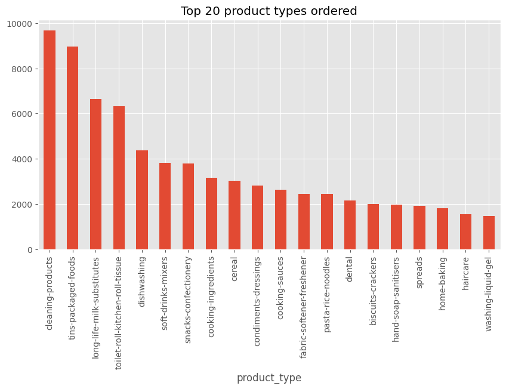
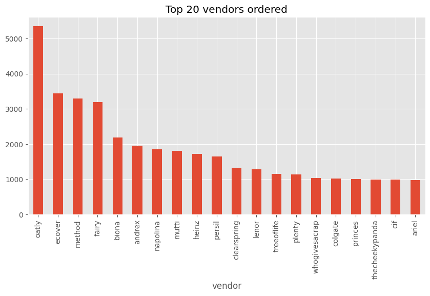
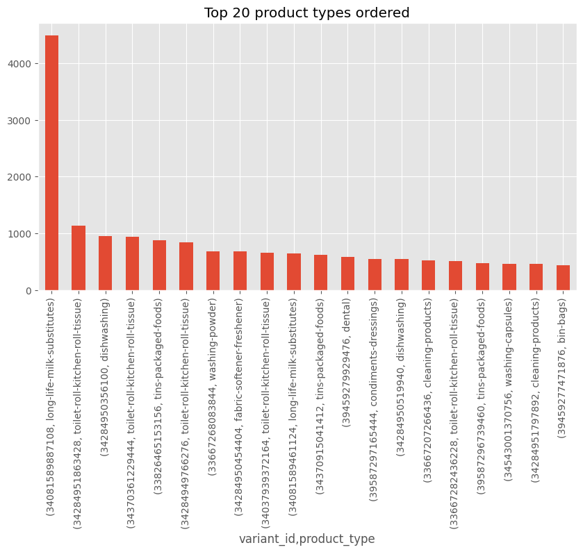
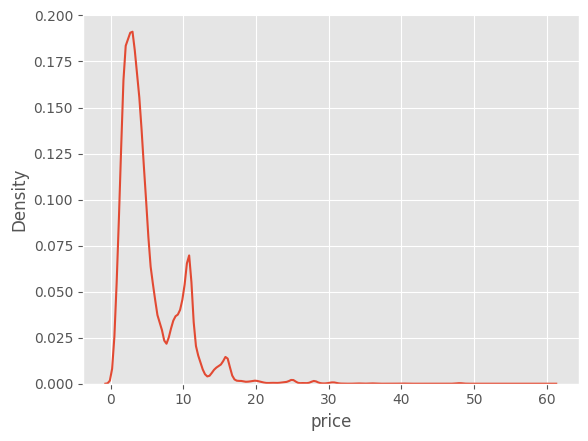
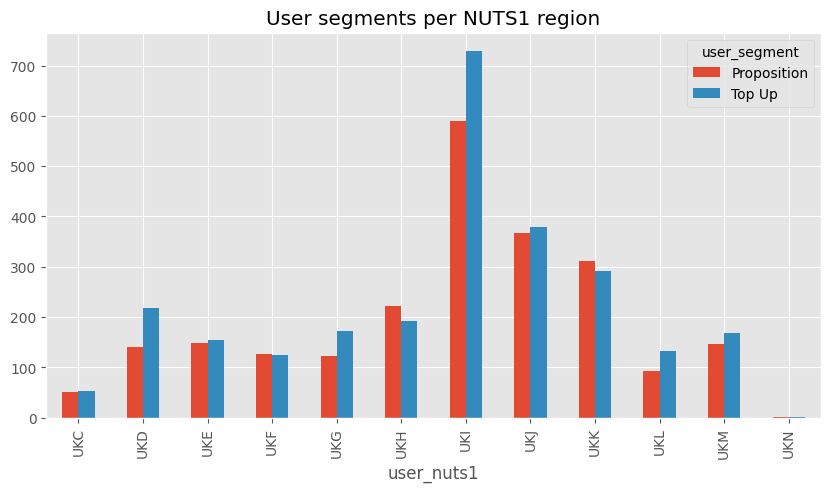
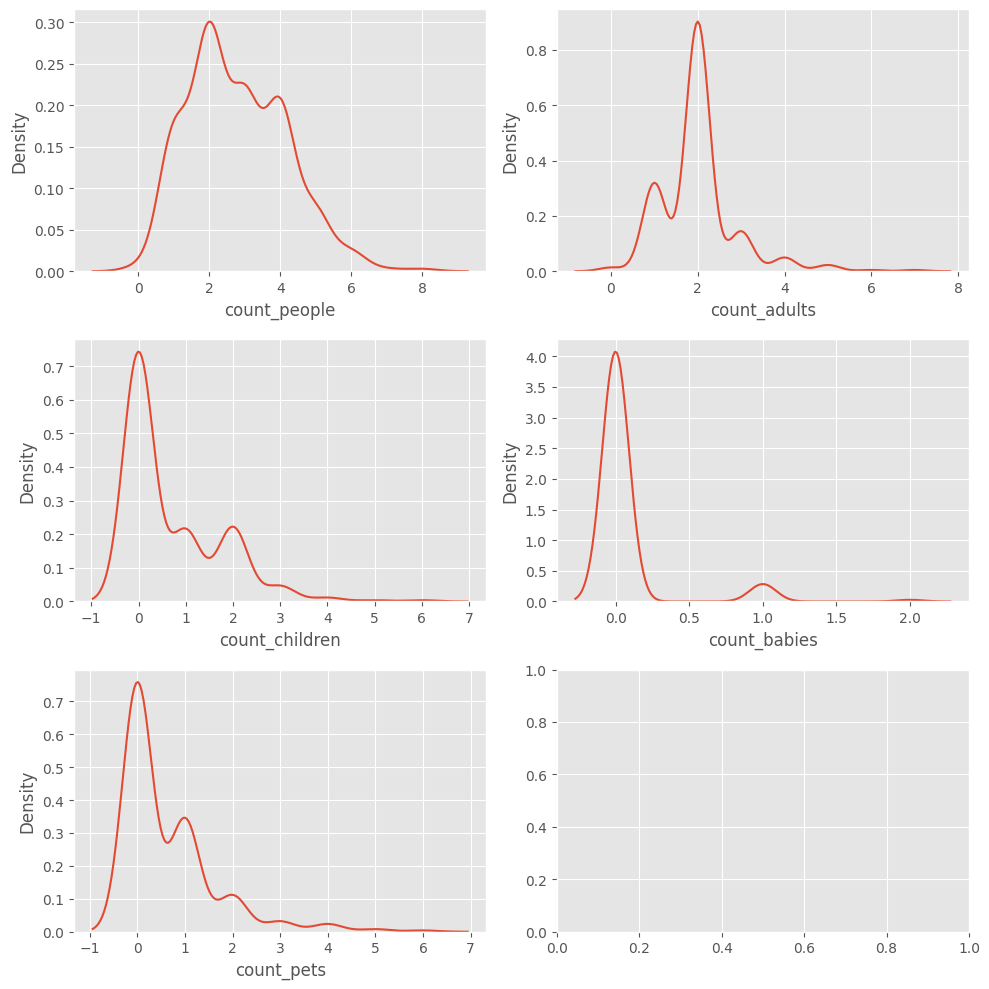
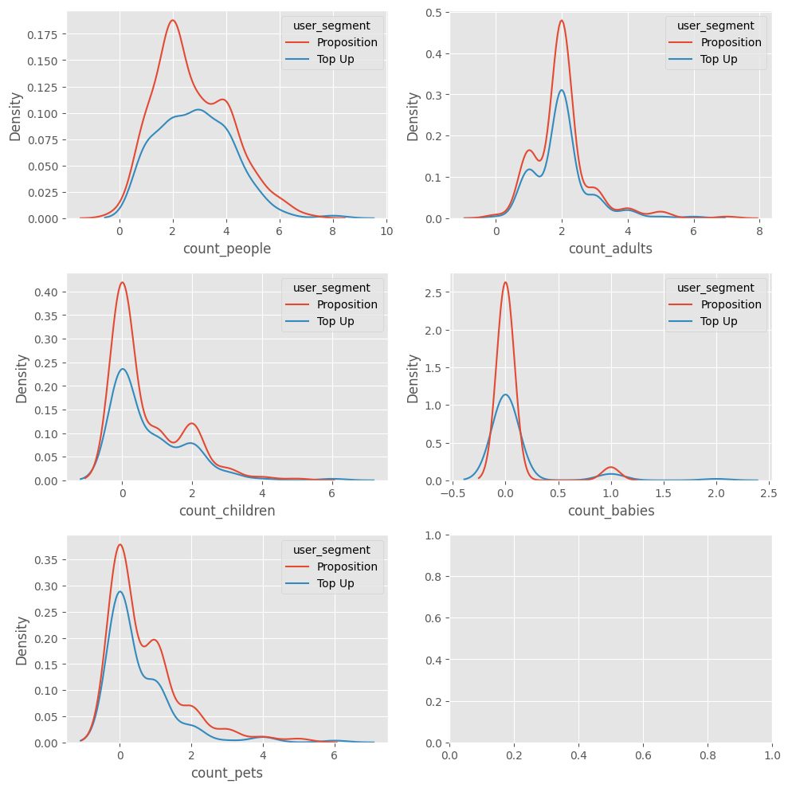
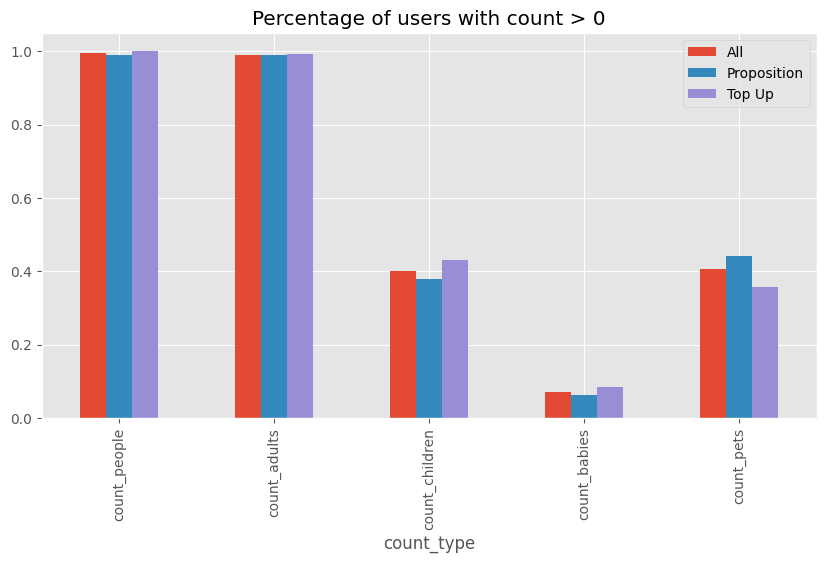

```python
import pandas as pd
import numpy as np
import matplotlib.pyplot as plt
import seaborn as sns
```


```python
plt.style.use('ggplot')
```


```python
# Dataset paths

DATA_DIR = '../../data/sampled-datasets/'
DATA_NAMES = ['users', 'inventory', 'orders', 'abandoned_carts', 'regulars']
EXTENSION = '.parquet'
FILES = {name: DATA_DIR + name + EXTENSION for name in DATA_NAMES}
FILES
```


    {'users': '../../data/sampled-datasets/users.parquet',
     'inventory': '../../data/sampled-datasets/inventory.parquet',
     'orders': '../../data/sampled-datasets/orders.parquet',
     'abandoned_carts': '../../data/sampled-datasets/abandoned_carts.parquet',
     'regulars': '../../data/sampled-datasets/regulars.parquet'}


```python
orders = pd.read_parquet(FILES['orders'])
```


```python
orders.info()
```

    <class 'pandas.core.frame.DataFrame'>
    Index: 8773 entries, 10 to 64538
    Data columns (total 6 columns):
     #   Column          Non-Null Count  Dtype         
    ---  ------          --------------  -----         
     0   id              8773 non-null   int64         
     1   user_id         8773 non-null   object        
     2   created_at      8773 non-null   datetime64[us]
     3   order_date      8773 non-null   datetime64[us]
     4   user_order_seq  8773 non-null   int64         
     5   ordered_items   8773 non-null   object        
    dtypes: datetime64[us](2), int64(2), object(2)
    memory usage: 479.8+ KB


```python
orders.head()
```


<div>
<style scoped>
    .dataframe tbody tr th:only-of-type {
        vertical-align: middle;
    }

    .dataframe tbody tr th {
        vertical-align: top;
    }

    .dataframe thead th {
        text-align: right;
    }
</style>
<table border="1" class="dataframe">
  <thead>
    <tr style="text-align: right;">
      <th></th>
      <th>id</th>
      <th>user_id</th>
      <th>created_at</th>
      <th>order_date</th>
      <th>user_order_seq</th>
      <th>ordered_items</th>
    </tr>
  </thead>
  <tbody>
    <tr>
      <th>10</th>
      <td>2204073066628</td>
      <td>62e271062eb827e411bd73941178d29b022f5f2de9d37f...</td>
      <td>2020-04-30 14:32:19</td>
      <td>2020-04-30</td>
      <td>1</td>
      <td>[33618849693828, 33618860179588, 3361887404045...</td>
    </tr>
    <tr>
      <th>20</th>
      <td>2204707520644</td>
      <td>bf591c887c46d5d3513142b6a855dd7ffb9cc00697f6f5...</td>
      <td>2020-04-30 17:39:00</td>
      <td>2020-04-30</td>
      <td>1</td>
      <td>[33618835243140, 33618835964036, 3361886244058...</td>
    </tr>
    <tr>
      <th>21</th>
      <td>2204838822020</td>
      <td>329f08c66abb51f8c0b8a9526670da2d94c0c6eef06700...</td>
      <td>2020-04-30 18:12:30</td>
      <td>2020-04-30</td>
      <td>1</td>
      <td>[33618891145348, 33618893570180, 3361889766618...</td>
    </tr>
    <tr>
      <th>34</th>
      <td>2208967852164</td>
      <td>f6451fce7b1c58d0effbe37fcb4e67b718193562766470...</td>
      <td>2020-05-01 19:44:11</td>
      <td>2020-05-01</td>
      <td>1</td>
      <td>[33618830196868, 33618846580868, 3361891234624...</td>
    </tr>
    <tr>
      <th>49</th>
      <td>2215889436804</td>
      <td>68e872ff888303bff58ec56a3a986f77ddebdbe5c279e7...</td>
      <td>2020-05-03 21:56:14</td>
      <td>2020-05-03</td>
      <td>1</td>
      <td>[33667166699652, 33667166699652, 3366717122163...</td>
    </tr>
  </tbody>
</table>
</div>


```python
abandoned_carts = pd.read_parquet(FILES['abandoned_carts'])
```


```python
abandoned_carts.info()
```

    <class 'pandas.core.frame.DataFrame'>
    Index: 5457 entries, 0 to 70050
    Data columns (total 4 columns):
     #   Column      Non-Null Count  Dtype         
    ---  ------      --------------  -----         
     0   id          5457 non-null   int64         
     1   user_id     5457 non-null   object        
     2   created_at  5457 non-null   datetime64[us]
     3   variant_id  5457 non-null   object        
    dtypes: datetime64[us](1), int64(1), object(2)
    memory usage: 213.2+ KB


```python
abandoned_carts.head()
```


<div>
<style scoped>
    .dataframe tbody tr th:only-of-type {
        vertical-align: middle;
    }

    .dataframe tbody tr th {
        vertical-align: top;
    }

    .dataframe thead th {
        text-align: right;
    }
</style>
<table border="1" class="dataframe">
  <thead>
    <tr style="text-align: right;">
      <th></th>
      <th>id</th>
      <th>user_id</th>
      <th>created_at</th>
      <th>variant_id</th>
    </tr>
  </thead>
  <tbody>
    <tr>
      <th>0</th>
      <td>12858560217220</td>
      <td>5c4e5953f13ddc3bc9659a3453356155e5efe4739d7a2b...</td>
      <td>2020-05-20 13:53:24</td>
      <td>[33826459287684, 33826457616516, 3366719212762...</td>
    </tr>
    <tr>
      <th>13</th>
      <td>20352449839236</td>
      <td>9d6187545c005d39e44d0456d87790db18611d7c7379bd...</td>
      <td>2021-06-27 05:24:13</td>
      <td>[34415988179076, 34037940158596, 3450282236326...</td>
    </tr>
    <tr>
      <th>45</th>
      <td>20478401413252</td>
      <td>e83fb0273d70c37a2968fee107113698fd4f389c442c0b...</td>
      <td>2021-07-18 08:23:49</td>
      <td>[34543001337988, 34037939372164, 3411360609088...</td>
    </tr>
    <tr>
      <th>50</th>
      <td>20481783103620</td>
      <td>10c42e10e530284b7c7c50f3a23a98726d5747b8128084...</td>
      <td>2021-07-18 21:29:36</td>
      <td>[33667268116612, 34037940224132, 3443605520397...</td>
    </tr>
    <tr>
      <th>52</th>
      <td>20485321687172</td>
      <td>d9989439524b3f6fc4f41686d043f315fb408b954d6153...</td>
      <td>2021-07-19 12:17:05</td>
      <td>[33667268083844, 34284950454404, 33973246886020]</td>
    </tr>
  </tbody>
</table>
</div>


```python
inventory = pd.read_parquet(FILES['inventory'])
```


```python
inventory.info()
```

    <class 'pandas.core.frame.DataFrame'>
    RangeIndex: 1733 entries, 0 to 1732
    Data columns (total 6 columns):
     #   Column            Non-Null Count  Dtype  
    ---  ------            --------------  -----  
     0   variant_id        1733 non-null   int64  
     1   price             1733 non-null   float64
     2   compare_at_price  1733 non-null   float64
     3   vendor            1733 non-null   object 
     4   product_type      1733 non-null   object 
     5   tags              1733 non-null   object 
    dtypes: float64(2), int64(1), object(3)
    memory usage: 81.4+ KB


```python
inventory.head()
```


<div>
<style scoped>
    .dataframe tbody tr th:only-of-type {
        vertical-align: middle;
    }

    .dataframe tbody tr th {
        vertical-align: top;
    }

    .dataframe thead th {
        text-align: right;
    }
</style>
<table border="1" class="dataframe">
  <thead>
    <tr style="text-align: right;">
      <th></th>
      <th>variant_id</th>
      <th>price</th>
      <th>compare_at_price</th>
      <th>vendor</th>
      <th>product_type</th>
      <th>tags</th>
    </tr>
  </thead>
  <tbody>
    <tr>
      <th>0</th>
      <td>39587297165444</td>
      <td>3.09</td>
      <td>3.15</td>
      <td>heinz</td>
      <td>condiments-dressings</td>
      <td>[table-sauces, vegan]</td>
    </tr>
    <tr>
      <th>1</th>
      <td>34370361229444</td>
      <td>4.99</td>
      <td>5.50</td>
      <td>whogivesacrap</td>
      <td>toilet-roll-kitchen-roll-tissue</td>
      <td>[b-corp, eco, toilet-rolls]</td>
    </tr>
    <tr>
      <th>2</th>
      <td>34284951863428</td>
      <td>3.69</td>
      <td>3.99</td>
      <td>plenty</td>
      <td>toilet-roll-kitchen-roll-tissue</td>
      <td>[kitchen-roll]</td>
    </tr>
    <tr>
      <th>3</th>
      <td>33667283583108</td>
      <td>1.79</td>
      <td>1.99</td>
      <td>thecheekypanda</td>
      <td>toilet-roll-kitchen-roll-tissue</td>
      <td>[b-corp, cruelty-free, eco, tissue, vegan]</td>
    </tr>
    <tr>
      <th>4</th>
      <td>33803537973380</td>
      <td>1.99</td>
      <td>2.09</td>
      <td>colgate</td>
      <td>dental</td>
      <td>[dental-accessories]</td>
    </tr>
  </tbody>
</table>
</div>


```python
regulars = pd.read_parquet(FILES['regulars'])
```


```python
regulars.info()
```

    <class 'pandas.core.frame.DataFrame'>
    Index: 18105 entries, 3 to 37720
    Data columns (total 3 columns):
     #   Column      Non-Null Count  Dtype         
    ---  ------      --------------  -----         
     0   user_id     18105 non-null  object        
     1   variant_id  18105 non-null  int64         
     2   created_at  18105 non-null  datetime64[us]
    dtypes: datetime64[us](1), int64(1), object(1)
    memory usage: 565.8+ KB


```python
regulars.head()
```


<div>
<style scoped>
    .dataframe tbody tr th:only-of-type {
        vertical-align: middle;
    }

    .dataframe tbody tr th {
        vertical-align: top;
    }

    .dataframe thead th {
        text-align: right;
    }
</style>
<table border="1" class="dataframe">
  <thead>
    <tr style="text-align: right;">
      <th></th>
      <th>user_id</th>
      <th>variant_id</th>
      <th>created_at</th>
    </tr>
  </thead>
  <tbody>
    <tr>
      <th>3</th>
      <td>68e872ff888303bff58ec56a3a986f77ddebdbe5c279e7...</td>
      <td>33618848088196</td>
      <td>2020-04-30 15:07:03</td>
    </tr>
    <tr>
      <th>11</th>
      <td>aed88fc0b004270a62ff1fe4b94141f6b1db1496dbb0c0...</td>
      <td>33667178659972</td>
      <td>2020-05-05 23:34:35</td>
    </tr>
    <tr>
      <th>18</th>
      <td>68e872ff888303bff58ec56a3a986f77ddebdbe5c279e7...</td>
      <td>33619009208452</td>
      <td>2020-04-30 15:07:03</td>
    </tr>
    <tr>
      <th>46</th>
      <td>aed88fc0b004270a62ff1fe4b94141f6b1db1496dbb0c0...</td>
      <td>33667305373828</td>
      <td>2020-05-05 23:34:35</td>
    </tr>
    <tr>
      <th>47</th>
      <td>4594e99557113d5a1c5b59bf31b8704aafe5c7bd180b32...</td>
      <td>33667247341700</td>
      <td>2020-05-06 14:42:11</td>
    </tr>
  </tbody>
</table>
</div>


```python
users = pd.read_parquet(FILES['users'])
```


```python
users.info()
```

    <class 'pandas.core.frame.DataFrame'>
    Index: 4983 entries, 2160 to 3360
    Data columns (total 10 columns):
     #   Column                 Non-Null Count  Dtype  
    ---  ------                 --------------  -----  
     0   user_id                4983 non-null   object 
     1   user_segment           4983 non-null   object 
     2   user_nuts1             4932 non-null   object 
     3   first_ordered_at       4983 non-null   object 
     4   customer_cohort_month  4983 non-null   object 
     5   count_people           325 non-null    float64
     6   count_adults           325 non-null    float64
     7   count_children         325 non-null    float64
     8   count_babies           325 non-null    float64
     9   count_pets             325 non-null    float64
    dtypes: float64(5), object(5)
    memory usage: 428.2+ KB


```python
users.head()
```


<div>
<style scoped>
    .dataframe tbody tr th:only-of-type {
        vertical-align: middle;
    }

    .dataframe tbody tr th {
        vertical-align: top;
    }

    .dataframe thead th {
        text-align: right;
    }
</style>
<table border="1" class="dataframe">
  <thead>
    <tr style="text-align: right;">
      <th></th>
      <th>user_id</th>
      <th>user_segment</th>
      <th>user_nuts1</th>
      <th>first_ordered_at</th>
      <th>customer_cohort_month</th>
      <th>count_people</th>
      <th>count_adults</th>
      <th>count_children</th>
      <th>count_babies</th>
      <th>count_pets</th>
    </tr>
  </thead>
  <tbody>
    <tr>
      <th>2160</th>
      <td>0e823a42e107461379e5b5613b7aa00537a72e1b0eaa7a...</td>
      <td>Top Up</td>
      <td>UKH</td>
      <td>2021-05-08 13:33:49</td>
      <td>2021-05-01 00:00:00</td>
      <td>NaN</td>
      <td>NaN</td>
      <td>NaN</td>
      <td>NaN</td>
      <td>NaN</td>
    </tr>
    <tr>
      <th>1123</th>
      <td>15768ced9bed648f745a7aa566a8895f7a73b9a47c1d4f...</td>
      <td>Top Up</td>
      <td>UKJ</td>
      <td>2021-11-17 16:30:20</td>
      <td>2021-11-01 00:00:00</td>
      <td>NaN</td>
      <td>NaN</td>
      <td>NaN</td>
      <td>NaN</td>
      <td>NaN</td>
    </tr>
    <tr>
      <th>1958</th>
      <td>33e0cb6eacea0775e34adbaa2c1dec16b9d6484e6b9324...</td>
      <td>Top Up</td>
      <td>UKD</td>
      <td>2022-03-09 23:12:25</td>
      <td>2022-03-01 00:00:00</td>
      <td>NaN</td>
      <td>NaN</td>
      <td>NaN</td>
      <td>NaN</td>
      <td>NaN</td>
    </tr>
    <tr>
      <th>675</th>
      <td>57ca7591dc79825df0cecc4836a58e6062454555c86c35...</td>
      <td>Top Up</td>
      <td>UKI</td>
      <td>2021-04-23 16:29:02</td>
      <td>2021-04-01 00:00:00</td>
      <td>NaN</td>
      <td>NaN</td>
      <td>NaN</td>
      <td>NaN</td>
      <td>NaN</td>
    </tr>
    <tr>
      <th>4694</th>
      <td>085d8e598139ce6fc9f75d9de97960fa9e1457b409ec00...</td>
      <td>Top Up</td>
      <td>UKJ</td>
      <td>2021-11-02 13:50:06</td>
      <td>2021-11-01 00:00:00</td>
      <td>NaN</td>
      <td>NaN</td>
      <td>NaN</td>
      <td>NaN</td>
      <td>NaN</td>
    </tr>
  </tbody>
</table>
</div>


## Products analysis 


```python
products_ordered = orders.explode('ordered_items').reset_index(drop=True)
```


```python
products_ordered = products_ordered.merge(inventory, left_on='ordered_items', right_on='variant_id').rename(columns={'id': 'order_id'})
```


```python
products_ordered.info()
```

    <class 'pandas.core.frame.DataFrame'>
    RangeIndex: 92361 entries, 0 to 92360
    Data columns (total 12 columns):
     #   Column            Non-Null Count  Dtype         
    ---  ------            --------------  -----         
     0   order_id          92361 non-null  int64         
     1   user_id           92361 non-null  object        
     2   created_at        92361 non-null  datetime64[us]
     3   order_date        92361 non-null  datetime64[us]
     4   user_order_seq    92361 non-null  int64         
     5   ordered_items     92361 non-null  object        
     6   variant_id        92361 non-null  int64         
     7   price             92361 non-null  float64       
     8   compare_at_price  92361 non-null  float64       
     9   vendor            92361 non-null  object        
     10  product_type      92361 non-null  object        
     11  tags              92361 non-null  object        
    dtypes: datetime64[us](2), float64(2), int64(3), object(5)
    memory usage: 8.5+ MB


```python
products_ordered.head()
```


<div>
<style scoped>
    .dataframe tbody tr th:only-of-type {
        vertical-align: middle;
    }

    .dataframe tbody tr th {
        vertical-align: top;
    }

    .dataframe thead th {
        text-align: right;
    }
</style>
<table border="1" class="dataframe">
  <thead>
    <tr style="text-align: right;">
      <th></th>
      <th>order_id</th>
      <th>user_id</th>
      <th>created_at</th>
      <th>order_date</th>
      <th>user_order_seq</th>
      <th>ordered_items</th>
      <th>variant_id</th>
      <th>price</th>
      <th>compare_at_price</th>
      <th>vendor</th>
      <th>product_type</th>
      <th>tags</th>
    </tr>
  </thead>
  <tbody>
    <tr>
      <th>0</th>
      <td>2215889436804</td>
      <td>68e872ff888303bff58ec56a3a986f77ddebdbe5c279e7...</td>
      <td>2020-05-03 21:56:14</td>
      <td>2020-05-03</td>
      <td>1</td>
      <td>33667238658180</td>
      <td>33667238658180</td>
      <td>4.19</td>
      <td>5.10</td>
      <td>listerine</td>
      <td>dental</td>
      <td>[mouthwash]</td>
    </tr>
    <tr>
      <th>1</th>
      <td>2215889436804</td>
      <td>68e872ff888303bff58ec56a3a986f77ddebdbe5c279e7...</td>
      <td>2020-05-03 21:56:14</td>
      <td>2020-05-03</td>
      <td>1</td>
      <td>33667238658180</td>
      <td>33667238658180</td>
      <td>4.19</td>
      <td>5.10</td>
      <td>listerine</td>
      <td>dental</td>
      <td>[mouthwash]</td>
    </tr>
    <tr>
      <th>2</th>
      <td>2217346236548</td>
      <td>66a7b6a77952abc3ef3246da56fb148814704a3c2b420c...</td>
      <td>2020-05-04 11:25:26</td>
      <td>2020-05-04</td>
      <td>1</td>
      <td>33667206054020</td>
      <td>33667206054020</td>
      <td>17.99</td>
      <td>20.65</td>
      <td>ecover</td>
      <td>delicates-stain-remover</td>
      <td>[cruelty-free, delicates-stain-remover, eco, v...</td>
    </tr>
    <tr>
      <th>3</th>
      <td>2217346236548</td>
      <td>66a7b6a77952abc3ef3246da56fb148814704a3c2b420c...</td>
      <td>2020-05-04 11:25:26</td>
      <td>2020-05-04</td>
      <td>1</td>
      <td>33667206283396</td>
      <td>33667206283396</td>
      <td>9.99</td>
      <td>12.00</td>
      <td>ecover</td>
      <td>fabric-softener-freshener</td>
      <td>[cruelty-free, eco, fabric-softener-freshener,...</td>
    </tr>
    <tr>
      <th>4</th>
      <td>2217346236548</td>
      <td>66a7b6a77952abc3ef3246da56fb148814704a3c2b420c...</td>
      <td>2020-05-04 11:25:26</td>
      <td>2020-05-04</td>
      <td>1</td>
      <td>39459277602948</td>
      <td>39459277602948</td>
      <td>5.79</td>
      <td>5.98</td>
      <td>ecloth</td>
      <td>cleaning-products</td>
      <td>[eco, sponges-cloths-gloves]</td>
    </tr>
  </tbody>
</table>
</div>


```python

products_ordered['product_type'].value_counts()
```


    product_type
    cleaning-products                  9676
    tins-packaged-foods                8959
    long-life-milk-substitutes         6637
    toilet-roll-kitchen-roll-tissue    6314
    dishwashing                        4362
    soft-drinks-mixers                 3808
    snacks-confectionery               3787
    cooking-ingredients                3150
    cereal                             3014
    condiments-dressings               2821
    cooking-sauces                     2631
    fabric-softener-freshener          2443
    pasta-rice-noodles                 2443
    dental                             2161
    biscuits-crackers                  2008
    hand-soap-sanitisers               1981
    spreads                            1926
    home-baking                        1808
    haircare                           1552
    washing-liquid-gel                 1482
    washing-powder                     1475
    tea                                1232
    bath-shower-gel                    1142
    skincare                           1128
    washing-capsules                   1127
    bin-bags                           1083
    period-care                        1026
    wine                               1009
    cat-food                            963
    beer                                953
    food-bags-cling-film-foil           848
    baby-kids-toiletries                825
    baby-milk-formula                   787
    coffee                              729
    dog-food                            677
    delicates-stain-remover             648
    spirits-liqueurs                    578
    baby-toddler-food                   484
    nappies-nappy-pants                 348
    baby-accessories                    307
    deodorant                           299
    drying-ironing                      245
    pet-care                            238
    cider                               215
    shaving-grooming                    205
    superfoods-supplements              159
    household-sundries                  146
    medicines-treatments                 97
    water-softener                       82
    other-hot-drinks                     68
    low-no-alcohol                       58
    sexual-health                        42
    maternity                            40
    adult-incontinence                   39
    suncare                              38
    premixed-cocktails                   29
    medicine-treatments                  27
    mixed-bundles                         2
    Name: count, dtype: int64


```python
products_ordered['product_type'].value_counts()[:20].plot(kind='bar', figsize=(10, 5), title='Top 20 product types ordered')
```


    <Axes: title={'center': 'Top 20 product types ordered'}, xlabel='product_type'>


    

    


```python
products_ordered['vendor'].value_counts()
```


    vendor
    oatly             5345
    ecover            3445
    method            3293
    fairy             3188
    biona             2184
                      ... 
    gordans              1
    enterosgel           1
    attitude             1
    sudafed              1
    stlawrencegold       1
    Name: count, Length: 402, dtype: int64


```python
products_ordered['vendor'].value_counts()[:20].plot(kind='bar', figsize=(10, 5), title='Top 20 vendors ordered')
```


    <Axes: title={'center': 'Top 20 vendors ordered'}, xlabel='vendor'>


    

    


```python
products_ordered.groupby('variant_id')['product_type'].value_counts().sort_values(ascending=False)
```


    variant_id      product_type                   
    34081589887108  long-life-milk-substitutes         4487
    34284951863428  toilet-roll-kitchen-roll-tissue    1133
    34284950356100  dishwashing                         954
    34370361229444  toilet-roll-kitchen-roll-tissue     939
    33826465153156  tins-packaged-foods                 884
                                                       ... 
    34534187958404  baby-accessories                      1
    39454054547588  dog-food                              1
    34519124410500  premixed-cocktails                    1
    39397851562116  haircare                              1
    39397851037828  baby-kids-toiletries                  1
    Name: count, Length: 1477, dtype: int64


```python
products_ordered.groupby('variant_id')['product_type'].value_counts().sort_values(ascending=False)[:20].plot(kind='bar', figsize=(10, 5), title='Top 20 product types ordered')
```


    <Axes: title={'center': 'Top 20 product types ordered'}, xlabel='variant_id,product_type'>


    

    


We can see that there is a product that is ordered much more than the others.


```python
most_ordered_product = products_ordered['variant_id'].value_counts().idxmax()
most_ordered_price = products_ordered[products_ordered['variant_id'] == most_ordered_product]['price'].unique()[0]
print('The price of the most ordered product is:', most_ordered_price)
sec_most_ordered_product = products_ordered['variant_id'].value_counts().index[1]
sec_most_ordered_price = products_ordered[products_ordered['variant_id'] == sec_most_ordered_product]['price'].unique()[0]
print('The price of the second most ordered product is:', sec_most_ordered_price)
```

    The price of the most ordered product is: 10.79
    The price of the second most ordered product is: 3.69


```python
products_ordered['price'].describe()
```


    count    92361.000000
    mean         5.303274
    std          4.217812
    min          0.570000
    25%          2.490000
    50%          3.990000
    75%          6.990000
    max         59.990000
    Name: price, dtype: float64


```python
# products_ordered['price'].plot(kind='hist', bins=50, figsize=(10, 5), title='Price distribution')
sns.kdeplot(products_ordered['price'], )
```


    <Axes: xlabel='price', ylabel='Density'>


    

    


The price of the most ordered product affects the price distribution, as there is a peak around 11


```python
products_ordered_type_proportion = products_ordered['product_type'].value_counts(normalize=True).reset_index().reset_index()
```


```python
products_ordered_type_proportion.head(10)
```


<div>
<style scoped>
    .dataframe tbody tr th:only-of-type {
        vertical-align: middle;
    }

    .dataframe tbody tr th {
        vertical-align: top;
    }

    .dataframe thead th {
        text-align: right;
    }
</style>
<table border="1" class="dataframe">
  <thead>
    <tr style="text-align: right;">
      <th></th>
      <th>index</th>
      <th>product_type</th>
      <th>proportion</th>
    </tr>
  </thead>
  <tbody>
    <tr>
      <th>0</th>
      <td>0</td>
      <td>cleaning-products</td>
      <td>0.104763</td>
    </tr>
    <tr>
      <th>1</th>
      <td>1</td>
      <td>tins-packaged-foods</td>
      <td>0.097000</td>
    </tr>
    <tr>
      <th>2</th>
      <td>2</td>
      <td>long-life-milk-substitutes</td>
      <td>0.071859</td>
    </tr>
    <tr>
      <th>3</th>
      <td>3</td>
      <td>toilet-roll-kitchen-roll-tissue</td>
      <td>0.068362</td>
    </tr>
    <tr>
      <th>4</th>
      <td>4</td>
      <td>dishwashing</td>
      <td>0.047228</td>
    </tr>
    <tr>
      <th>5</th>
      <td>5</td>
      <td>soft-drinks-mixers</td>
      <td>0.041230</td>
    </tr>
    <tr>
      <th>6</th>
      <td>6</td>
      <td>snacks-confectionery</td>
      <td>0.041002</td>
    </tr>
    <tr>
      <th>7</th>
      <td>7</td>
      <td>cooking-ingredients</td>
      <td>0.034105</td>
    </tr>
    <tr>
      <th>8</th>
      <td>8</td>
      <td>cereal</td>
      <td>0.032633</td>
    </tr>
    <tr>
      <th>9</th>
      <td>9</td>
      <td>condiments-dressings</td>
      <td>0.030543</td>
    </tr>
  </tbody>
</table>
</div>


```python
inventory_type_proportion = inventory['product_type'].value_counts(normalize=True).reset_index().reset_index()
```


```python
inventory_type_proportion.head()
```


<div>
<style scoped>
    .dataframe tbody tr th:only-of-type {
        vertical-align: middle;
    }

    .dataframe tbody tr th {
        vertical-align: top;
    }

    .dataframe thead th {
        text-align: right;
    }
</style>
<table border="1" class="dataframe">
  <thead>
    <tr style="text-align: right;">
      <th></th>
      <th>index</th>
      <th>product_type</th>
      <th>proportion</th>
    </tr>
  </thead>
  <tbody>
    <tr>
      <th>0</th>
      <td>0</td>
      <td>cleaning-products</td>
      <td>0.092325</td>
    </tr>
    <tr>
      <th>1</th>
      <td>1</td>
      <td>tins-packaged-foods</td>
      <td>0.072129</td>
    </tr>
    <tr>
      <th>2</th>
      <td>2</td>
      <td>snacks-confectionery</td>
      <td>0.070398</td>
    </tr>
    <tr>
      <th>3</th>
      <td>3</td>
      <td>cooking-ingredients</td>
      <td>0.042123</td>
    </tr>
    <tr>
      <th>4</th>
      <td>4</td>
      <td>pasta-rice-noodles</td>
      <td>0.038084</td>
    </tr>
  </tbody>
</table>
</div>


```python
products_ordered_type_proportion = products_ordered_type_proportion.merge(inventory_type_proportion, on='product_type', suffixes=('_ordered', '_inventory'))
```


```python
products_ordered_type_proportion['proportion_ratio'] = products_ordered_type_proportion['proportion_inventory'] / products_ordered_type_proportion['proportion_ordered']
```


```python
products_ordered_type_proportion.head(15)
```


<div>
<style scoped>
    .dataframe tbody tr th:only-of-type {
        vertical-align: middle;
    }

    .dataframe tbody tr th {
        vertical-align: top;
    }

    .dataframe thead th {
        text-align: right;
    }
</style>
<table border="1" class="dataframe">
  <thead>
    <tr style="text-align: right;">
      <th></th>
      <th>index_ordered</th>
      <th>product_type</th>
      <th>proportion_ordered</th>
      <th>index_inventory</th>
      <th>proportion_inventory</th>
      <th>proportion_ratio</th>
    </tr>
  </thead>
  <tbody>
    <tr>
      <th>0</th>
      <td>0</td>
      <td>cleaning-products</td>
      <td>0.104763</td>
      <td>0</td>
      <td>0.092325</td>
      <td>0.881281</td>
    </tr>
    <tr>
      <th>1</th>
      <td>1</td>
      <td>tins-packaged-foods</td>
      <td>0.097000</td>
      <td>1</td>
      <td>0.072129</td>
      <td>0.743602</td>
    </tr>
    <tr>
      <th>2</th>
      <td>2</td>
      <td>long-life-milk-substitutes</td>
      <td>0.071859</td>
      <td>24</td>
      <td>0.013849</td>
      <td>0.192721</td>
    </tr>
    <tr>
      <th>3</th>
      <td>3</td>
      <td>toilet-roll-kitchen-roll-tissue</td>
      <td>0.068362</td>
      <td>31</td>
      <td>0.010387</td>
      <td>0.151935</td>
    </tr>
    <tr>
      <th>4</th>
      <td>4</td>
      <td>dishwashing</td>
      <td>0.047228</td>
      <td>21</td>
      <td>0.015580</td>
      <td>0.329889</td>
    </tr>
    <tr>
      <th>5</th>
      <td>5</td>
      <td>soft-drinks-mixers</td>
      <td>0.041230</td>
      <td>10</td>
      <td>0.027698</td>
      <td>0.671791</td>
    </tr>
    <tr>
      <th>6</th>
      <td>6</td>
      <td>snacks-confectionery</td>
      <td>0.041002</td>
      <td>2</td>
      <td>0.070398</td>
      <td>1.716938</td>
    </tr>
    <tr>
      <th>7</th>
      <td>7</td>
      <td>cooking-ingredients</td>
      <td>0.034105</td>
      <td>3</td>
      <td>0.042123</td>
      <td>1.235101</td>
    </tr>
    <tr>
      <th>8</th>
      <td>8</td>
      <td>cereal</td>
      <td>0.032633</td>
      <td>7</td>
      <td>0.029429</td>
      <td>0.901814</td>
    </tr>
    <tr>
      <th>9</th>
      <td>9</td>
      <td>condiments-dressings</td>
      <td>0.030543</td>
      <td>6</td>
      <td>0.030006</td>
      <td>0.982404</td>
    </tr>
    <tr>
      <th>10</th>
      <td>10</td>
      <td>cooking-sauces</td>
      <td>0.028486</td>
      <td>13</td>
      <td>0.024812</td>
      <td>0.871039</td>
    </tr>
    <tr>
      <th>11</th>
      <td>11</td>
      <td>fabric-softener-freshener</td>
      <td>0.026451</td>
      <td>34</td>
      <td>0.009810</td>
      <td>0.370865</td>
    </tr>
    <tr>
      <th>12</th>
      <td>12</td>
      <td>pasta-rice-noodles</td>
      <td>0.026451</td>
      <td>4</td>
      <td>0.038084</td>
      <td>1.439828</td>
    </tr>
    <tr>
      <th>13</th>
      <td>13</td>
      <td>dental</td>
      <td>0.023397</td>
      <td>14</td>
      <td>0.024235</td>
      <td>1.035821</td>
    </tr>
    <tr>
      <th>14</th>
      <td>14</td>
      <td>biscuits-crackers</td>
      <td>0.021741</td>
      <td>9</td>
      <td>0.028275</td>
      <td>1.300536</td>
    </tr>
  </tbody>
</table>
</div>


There are some types where the `index_ordered` isn't matching the `index_inventory`, so that types are ordered more (or less) than they are in the inventory (in proportion).

This can happen because there are some types that contain only a few products, so if the customers order a lot of them, the proportion of the orders will be higher than the proportion of the inventory fot that types.
This happens with the types with the lowest `proportion_inventory`/`proportion_ordered` ratio.

The oposite happens with the types with the highest `proportion_inventory`/`proportion_ordered` ratio. They are ordered less than they are in the inventory, which means that the customers have too much options for that type, so they don't order them as much as they are in the inventory.

The types with a ratio near 1 are the ones that are ordered as much as they are in the inventory.

## Users analysis


```python
count_cols = [col for col in users.columns if 'count' in col]
users_complete = users.dropna(subset=count_cols)
```


```python
users_complete.head()
```


<div>
<style scoped>
    .dataframe tbody tr th:only-of-type {
        vertical-align: middle;
    }

    .dataframe tbody tr th {
        vertical-align: top;
    }

    .dataframe thead th {
        text-align: right;
    }
</style>
<table border="1" class="dataframe">
  <thead>
    <tr style="text-align: right;">
      <th></th>
      <th>user_id</th>
      <th>user_segment</th>
      <th>user_nuts1</th>
      <th>first_ordered_at</th>
      <th>customer_cohort_month</th>
      <th>count_people</th>
      <th>count_adults</th>
      <th>count_children</th>
      <th>count_babies</th>
      <th>count_pets</th>
    </tr>
  </thead>
  <tbody>
    <tr>
      <th>4751</th>
      <td>09d70e0b0778117aec5550c08032d56f8e06f992741680...</td>
      <td>Proposition</td>
      <td>UKI</td>
      <td>2021-06-28 12:07:04</td>
      <td>2021-06-01 00:00:00</td>
      <td>1.0</td>
      <td>1.0</td>
      <td>0.0</td>
      <td>0.0</td>
      <td>0.0</td>
    </tr>
    <tr>
      <th>3154</th>
      <td>4f5ff38ce5ed48096ba80dff80e167db1ad24b9ebdb00c...</td>
      <td>Top Up</td>
      <td>UKD</td>
      <td>2020-06-12 12:07:35</td>
      <td>2020-06-01 00:00:00</td>
      <td>3.0</td>
      <td>2.0</td>
      <td>0.0</td>
      <td>1.0</td>
      <td>0.0</td>
    </tr>
    <tr>
      <th>736</th>
      <td>7b2ae50bb11646436fa613394fc3e71e1a0cdc3ba30cdb...</td>
      <td>Proposition</td>
      <td>UKF</td>
      <td>2020-10-03 09:53:57</td>
      <td>2020-10-01 00:00:00</td>
      <td>2.0</td>
      <td>2.0</td>
      <td>0.0</td>
      <td>0.0</td>
      <td>2.0</td>
    </tr>
    <tr>
      <th>4792</th>
      <td>5e977a4aa2c57f306b8a22f92eaaa177f7dc31a52df82c...</td>
      <td>Proposition</td>
      <td>UKI</td>
      <td>2021-10-14 10:41:13</td>
      <td>2021-10-01 00:00:00</td>
      <td>2.0</td>
      <td>1.0</td>
      <td>1.0</td>
      <td>0.0</td>
      <td>1.0</td>
    </tr>
    <tr>
      <th>2217</th>
      <td>eafb89ad33eb377adb98a915b6a5a65f1284c2db517d07...</td>
      <td>Proposition</td>
      <td>UKH</td>
      <td>2022-01-20 15:53:09</td>
      <td>2022-01-01 00:00:00</td>
      <td>2.0</td>
      <td>2.0</td>
      <td>0.0</td>
      <td>0.0</td>
      <td>0.0</td>
    </tr>
  </tbody>
</table>
</div>


```python
users['user_segment'].value_counts()
```


    user_segment
    Top Up         2643
    Proposition    2340
    Name: count, dtype: int64


```python
users['user_nuts1'].value_counts()
```


    user_nuts1
    UKI    1318
    UKJ     745
    UKK     602
    UKH     414
    UKD     358
    UKM     315
    UKE     303
    UKG     295
    UKF     252
    UKL     224
    UKC     102
    UKN       4
    Name: count, dtype: int64


```python
pd.crosstab(users['user_nuts1'], users['user_segment']).plot(kind='bar', figsize=(10, 5), title='User segments per NUTS1 region')
```


    <Axes: title={'center': 'User segments per NUTS1 region'}, xlabel='user_nuts1'>


    

    


```python
users_complete[count_cols].describe()
```


<div>
<style scoped>
    .dataframe tbody tr th:only-of-type {
        vertical-align: middle;
    }

    .dataframe tbody tr th {
        vertical-align: top;
    }

    .dataframe thead th {
        text-align: right;
    }
</style>
<table border="1" class="dataframe">
  <thead>
    <tr style="text-align: right;">
      <th></th>
      <th>count_people</th>
      <th>count_adults</th>
      <th>count_children</th>
      <th>count_babies</th>
      <th>count_pets</th>
    </tr>
  </thead>
  <tbody>
    <tr>
      <th>count</th>
      <td>325.000000</td>
      <td>325.000000</td>
      <td>325.000000</td>
      <td>325.000000</td>
      <td>325.000000</td>
    </tr>
    <tr>
      <th>mean</th>
      <td>2.787692</td>
      <td>2.003077</td>
      <td>0.707692</td>
      <td>0.076923</td>
      <td>0.636923</td>
    </tr>
    <tr>
      <th>std</th>
      <td>1.365753</td>
      <td>0.869577</td>
      <td>1.026246</td>
      <td>0.289086</td>
      <td>0.995603</td>
    </tr>
    <tr>
      <th>min</th>
      <td>0.000000</td>
      <td>0.000000</td>
      <td>0.000000</td>
      <td>0.000000</td>
      <td>0.000000</td>
    </tr>
    <tr>
      <th>25%</th>
      <td>2.000000</td>
      <td>2.000000</td>
      <td>0.000000</td>
      <td>0.000000</td>
      <td>0.000000</td>
    </tr>
    <tr>
      <th>50%</th>
      <td>3.000000</td>
      <td>2.000000</td>
      <td>0.000000</td>
      <td>0.000000</td>
      <td>0.000000</td>
    </tr>
    <tr>
      <th>75%</th>
      <td>4.000000</td>
      <td>2.000000</td>
      <td>1.000000</td>
      <td>0.000000</td>
      <td>1.000000</td>
    </tr>
    <tr>
      <th>max</th>
      <td>8.000000</td>
      <td>7.000000</td>
      <td>6.000000</td>
      <td>2.000000</td>
      <td>6.000000</td>
    </tr>
  </tbody>
</table>
</div>


```python
fig, ax = plt.subplots(3, 2, figsize=(10, 10))
ax = ax.flatten()
for index, col in enumerate(count_cols):
    sns.kdeplot(users_complete, x=col, ax=ax[index])

plt.tight_layout()
```


    

    


Let's see if there are differences between both types of users.


```python

fig, ax = plt.subplots(3, 2, figsize=(10, 10))
ax = ax.flatten()
for index, col in enumerate(count_cols):
    sns.kdeplot(users_complete, x=col, hue='user_segment' ,ax=ax[index])

plt.tight_layout()
```


    

    


How many users have a value > 0 en any count column?


```python
count_dic = {}
for col in count_cols:
    percentage = len(users_complete[col].loc[lambda x: x > 0]) / len(users_complete[col])
    count_dic[col] = percentage

count_dic
```


    {'count_people': 0.9938461538461538,
     'count_adults': 0.9907692307692307,
     'count_children': 0.4,
     'count_babies': 0.07076923076923076,
     'count_pets': 0.40615384615384614}


```python
count_dic_proposition = {}

users_proposition = users_complete[users_complete['user_segment'] == "Proposition"]

for col in count_cols:
    percentage = len(users_proposition[col].loc[lambda x: x > 0]) / len(users_proposition[col])
    count_dic_proposition[col] = percentage

count_dic_proposition
```


    {'count_people': 0.9896373056994818,
     'count_adults': 0.9896373056994818,
     'count_children': 0.37823834196891193,
     'count_babies': 0.06217616580310881,
     'count_pets': 0.44041450777202074}


```python
count_dic_top = {}

users_top = users_complete[users_complete['user_segment'] == "Top Up"]

for col in count_cols:
    percentage = len(users_top[col].loc[lambda x: x > 0]) / len(users_top[col])
    count_dic_top[col] = percentage

count_dic_top
```


    {'count_people': 1.0,
     'count_adults': 0.9924242424242424,
     'count_children': 0.4318181818181818,
     'count_babies': 0.08333333333333333,
     'count_pets': 0.3560606060606061}


```python
count_df = pd.DataFrame([count_dic, count_dic_proposition, count_dic_top], index=['All', 'Proposition', 'Top Up']).T.reset_index().rename(columns={'index': 'count_type'})

count_df
```


<div>
<style scoped>
    .dataframe tbody tr th:only-of-type {
        vertical-align: middle;
    }

    .dataframe tbody tr th {
        vertical-align: top;
    }

    .dataframe thead th {
        text-align: right;
    }
</style>
<table border="1" class="dataframe">
  <thead>
    <tr style="text-align: right;">
      <th></th>
      <th>count_type</th>
      <th>All</th>
      <th>Proposition</th>
      <th>Top Up</th>
    </tr>
  </thead>
  <tbody>
    <tr>
      <th>0</th>
      <td>count_people</td>
      <td>0.993846</td>
      <td>0.989637</td>
      <td>1.000000</td>
    </tr>
    <tr>
      <th>1</th>
      <td>count_adults</td>
      <td>0.990769</td>
      <td>0.989637</td>
      <td>0.992424</td>
    </tr>
    <tr>
      <th>2</th>
      <td>count_children</td>
      <td>0.400000</td>
      <td>0.378238</td>
      <td>0.431818</td>
    </tr>
    <tr>
      <th>3</th>
      <td>count_babies</td>
      <td>0.070769</td>
      <td>0.062176</td>
      <td>0.083333</td>
    </tr>
    <tr>
      <th>4</th>
      <td>count_pets</td>
      <td>0.406154</td>
      <td>0.440415</td>
      <td>0.356061</td>
    </tr>
  </tbody>
</table>
</div>


```python
count_df.plot(kind='bar', x='count_type', figsize=(10, 5), title='Percentage of users with count > 0')
```


    <Axes: title={'center': 'Percentage of users with count > 0'}, xlabel='count_type'>


    

    


```python
dependent_proportion = users_complete.query('count_children > 0 or count_babies > 0 or count_pets > 0').shape[0] / users_complete.shape[0]

dependent_proportion
```


    0.6123076923076923


Let's look at the population with babies or pets based on the products ordered.


```python
tags = sorted(products_ordered['tags'].explode().unique())
```


```python
baby_tags = [x for x in tags if 'baby' in x]
baby_tags
```


    ['baby-toddler-snacks', 'baby-wipes']


```python
baby_types = [x for x in products_ordered['product_type'].unique() if 'baby' in x]
baby_types
```


    ['baby-kids-toiletries',
     'baby-toddler-food',
     'baby-accessories',
     'baby-milk-formula']


```python
baby_products = products_ordered[products_ordered['tags'].apply(lambda x: any(tag in x for tag in baby_tags)) | products_ordered['product_type'].apply(lambda x: any(tag in x for tag in baby_types))]
```

Here we get the ratio of users that have bought a baby related product.


```python
baby_ratio = baby_products['user_id'].nunique() / users.shape[0]
baby_ratio
```


    0.1346578366445916


```python
pet_tags = [x for x in tags if 'pet' in x or 'dog' in x or 'cat' in x]
pet_tags
```


    ['cat-treats',
     'delicates-stain-remover',
     'dog-treats',
     'dry-cat-food',
     'dry-dog-food',
     'pet-care',
     'wet-cat-food',
     'wet-dog-food']


```python
pet_types = [x for x in products_ordered['product_type'].unique() if 'pet-' in x or 'dog-' in x or 'cat-' in x]
pet_types
```


    ['pet-care', 'cat-food', 'dog-food']


```python
pet_products = products_ordered[products_ordered['tags'].apply(lambda x: any(tag in x for tag in pet_tags)) | products_ordered['product_type'].apply(lambda x: any(tag in x for tag in pet_types))]
```

Here we get the ratio of users that have bought a pet related product.


```python
pet_ratio = pet_products['user_id'].nunique() / users.shape[0]
```


    0.18783865141481035


The ratio of users that have bought a baby is slightly higher than the ratio of users that have said that they have a baby in the `count_baby` column. This can be because the users used to have a baby before but it has grown up, so they don't have a baby anymore.

The ratio of users that have bought a pet is lower than the ratio of users that have said that they have a pet in the `count_pet` column. It can happen because the data from `count_pet` is not accurate, or because the users buy the pet products at other shops.
