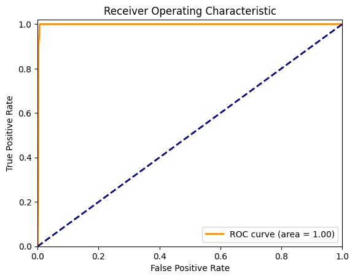
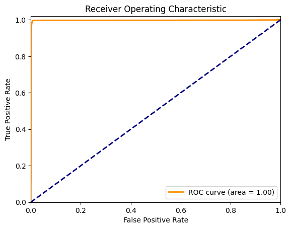
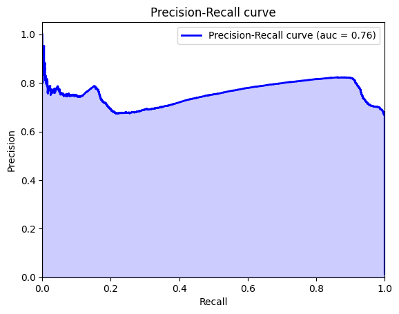
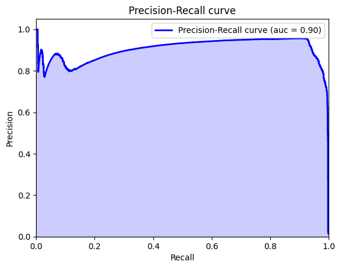
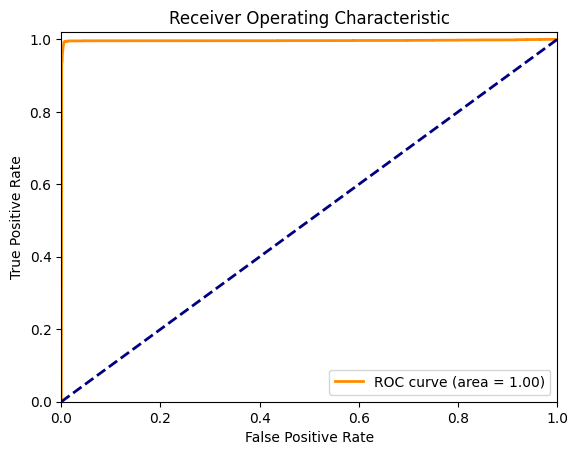

```python
import pandas as pd

from functions import (
    train_val_test_split,
    test_variables,
    get_best_treshold,
    print_metrics,
    plot_roc_curve,
    plot_precision_recall_curve
)
```


```python
df = pd.read_csv('../../data/box_builder_dataset/feature_frame.csv')
```

Let's remember what whe had in the previous task. This is the dataframe information and a sample of the data:


```python
df.info()
```

    <class 'pandas.core.frame.DataFrame'>
    RangeIndex: 2880549 entries, 0 to 2880548
    Data columns (total 27 columns):
     #   Column                            Dtype  
    ---  ------                            -----  
     0   variant_id                        int64  
     1   product_type                      object 
     2   order_id                          int64  
     3   user_id                           int64  
     4   created_at                        object 
     5   order_date                        object 
     6   user_order_seq                    int64  
     7   outcome                           float64
     8   ordered_before                    float64
     9   abandoned_before                  float64
     10  active_snoozed                    float64
     11  set_as_regular                    float64
     12  normalised_price                  float64
     13  discount_pct                      float64
     14  vendor                            object 
     15  global_popularity                 float64
     16  count_adults                      float64
     17  count_children                    float64
     18  count_babies                      float64
     19  count_pets                        float64
     20  people_ex_baby                    float64
     21  days_since_purchase_variant_id    float64
     22  avg_days_to_buy_variant_id        float64
     23  std_days_to_buy_variant_id        float64
     24  days_since_purchase_product_type  float64
     25  avg_days_to_buy_product_type      float64
     26  std_days_to_buy_product_type      float64
    dtypes: float64(19), int64(4), object(4)
    memory usage: 593.4+ MB


```python
df.head()
```


<div>
<style scoped>
    .dataframe tbody tr th:only-of-type {
        vertical-align: middle;
    }

    .dataframe tbody tr th {
        vertical-align: top;
    }

    .dataframe thead th {
        text-align: right;
    }
</style>
<table border="1" class="dataframe">
  <thead>
    <tr style="text-align: right;">
      <th></th>
      <th>variant_id</th>
      <th>product_type</th>
      <th>order_id</th>
      <th>user_id</th>
      <th>created_at</th>
      <th>order_date</th>
      <th>user_order_seq</th>
      <th>outcome</th>
      <th>ordered_before</th>
      <th>abandoned_before</th>
      <th>...</th>
      <th>count_children</th>
      <th>count_babies</th>
      <th>count_pets</th>
      <th>people_ex_baby</th>
      <th>days_since_purchase_variant_id</th>
      <th>avg_days_to_buy_variant_id</th>
      <th>std_days_to_buy_variant_id</th>
      <th>days_since_purchase_product_type</th>
      <th>avg_days_to_buy_product_type</th>
      <th>std_days_to_buy_product_type</th>
    </tr>
  </thead>
  <tbody>
    <tr>
      <th>0</th>
      <td>33826472919172</td>
      <td>ricepastapulses</td>
      <td>2807985930372</td>
      <td>3482464092292</td>
      <td>2020-10-05 16:46:19</td>
      <td>2020-10-05 00:00:00</td>
      <td>3</td>
      <td>0.0</td>
      <td>0.0</td>
      <td>0.0</td>
      <td>...</td>
      <td>0.0</td>
      <td>0.0</td>
      <td>0.0</td>
      <td>2.0</td>
      <td>33.0</td>
      <td>42.0</td>
      <td>31.134053</td>
      <td>30.0</td>
      <td>30.0</td>
      <td>24.27618</td>
    </tr>
    <tr>
      <th>1</th>
      <td>33826472919172</td>
      <td>ricepastapulses</td>
      <td>2808027644036</td>
      <td>3466586718340</td>
      <td>2020-10-05 17:59:51</td>
      <td>2020-10-05 00:00:00</td>
      <td>2</td>
      <td>0.0</td>
      <td>0.0</td>
      <td>0.0</td>
      <td>...</td>
      <td>0.0</td>
      <td>0.0</td>
      <td>0.0</td>
      <td>2.0</td>
      <td>33.0</td>
      <td>42.0</td>
      <td>31.134053</td>
      <td>30.0</td>
      <td>30.0</td>
      <td>24.27618</td>
    </tr>
    <tr>
      <th>2</th>
      <td>33826472919172</td>
      <td>ricepastapulses</td>
      <td>2808099078276</td>
      <td>3481384026244</td>
      <td>2020-10-05 20:08:53</td>
      <td>2020-10-05 00:00:00</td>
      <td>4</td>
      <td>0.0</td>
      <td>0.0</td>
      <td>0.0</td>
      <td>...</td>
      <td>0.0</td>
      <td>0.0</td>
      <td>0.0</td>
      <td>2.0</td>
      <td>33.0</td>
      <td>42.0</td>
      <td>31.134053</td>
      <td>30.0</td>
      <td>30.0</td>
      <td>24.27618</td>
    </tr>
    <tr>
      <th>3</th>
      <td>33826472919172</td>
      <td>ricepastapulses</td>
      <td>2808393957508</td>
      <td>3291363377284</td>
      <td>2020-10-06 08:57:59</td>
      <td>2020-10-06 00:00:00</td>
      <td>2</td>
      <td>0.0</td>
      <td>0.0</td>
      <td>0.0</td>
      <td>...</td>
      <td>0.0</td>
      <td>0.0</td>
      <td>0.0</td>
      <td>2.0</td>
      <td>33.0</td>
      <td>42.0</td>
      <td>31.134053</td>
      <td>30.0</td>
      <td>30.0</td>
      <td>24.27618</td>
    </tr>
    <tr>
      <th>4</th>
      <td>33826472919172</td>
      <td>ricepastapulses</td>
      <td>2808429314180</td>
      <td>3537167515780</td>
      <td>2020-10-06 10:37:05</td>
      <td>2020-10-06 00:00:00</td>
      <td>3</td>
      <td>0.0</td>
      <td>0.0</td>
      <td>0.0</td>
      <td>...</td>
      <td>0.0</td>
      <td>0.0</td>
      <td>0.0</td>
      <td>2.0</td>
      <td>33.0</td>
      <td>42.0</td>
      <td>31.134053</td>
      <td>30.0</td>
      <td>30.0</td>
      <td>24.27618</td>
    </tr>
  </tbody>
</table>
<p>5 rows × 27 columns</p>
</div>


## Preparing the dataset

To get the lenght of the orders, we have to get the products with `outcome` = 1, which means that they were ordered.


```python
ordered = df[df['outcome'] == 1]
```

We need to get the orders with at least 5 products

First we need to group the data by order_id and count the number of products in each order. Then we filter the orders with at least 5 products.


```python
orders_len = ordered.groupby('order_id')['variant_id'].count()
orders_len.describe()
```


    count    3427.000000
    mean        9.697111
    std         6.789204
    min         1.000000
    25%         5.000000
    50%         9.000000
    75%        13.000000
    max        78.000000
    Name: variant_id, dtype: float64


```python
orders_over_eq_5 = orders_len[orders_len >= 5].index
```


```python
df = df[df['order_id'].isin(orders_over_eq_5)]
```


```python
df.shape
```


    (2163953, 27)


```python
df['variant_id'].nunique()
```


    976


Now we have reduced the size of the dataset getting only the orders with at least 5 products. We can now start thinking about the next steps.

## Model building

The objective: *build a linear model that, given a user and a product, predicts if the user would purchase it if they were buying with us at that point in time.* 


The model may be based on logistic regression. 
It should predict if a user would buy a product or not, which is a binary outcome.
On the dataset we have a variable that contains this value, `outcome`, so we can use it as the target variable.

A first approach to the model could be to use the following features:
- times_ordered
- abandoned_before
- active_snoozed
- set_as_regular
- global_popularity
- days_to_purchase_variant_id_norm  * ordered_before = ((days_since_last_purchase_variant_id - avg_days_to_buy_variant_id) / std_days_to_buy_variant_id)  * ordered_before
- days_to_purchase_product_type_norm = (days_since_last_purchase_product_type - avg_days_to_buy_product_type) / std_days_to_buy_product_type

We can start with these features and then add or remove some of them to see if the model improves.


The model would look like this:

$$
log(\frac{p}{1-p}) = \beta_0 + \beta_1 \cdot times\_ordered + \beta_2 \cdot abandoned\_before + \\
+ \beta_3 \cdot active\_snoozed + \beta_4 \cdot set\_as\_regular + \beta_5 \cdot global\_popularity + \\
+ \beta_6 \cdot days\_to\_purchase\_variant\_id\_norm \cdot ordered\_before + \\
+ \beta_7 \cdot days\_to\_purchase\_product\_type\_norm
$$


```python
features = ['times_ordered', 'abandoned_before', 'active_snoozed', 'set_as_regular', 'global_popularity', 'days_to_purchase_variant_id_norm', 'days_to_purchase_variant_id_if_ordered_before', 'days_to_purchase_product_type_norm']
```

Now we have to create the variables that we are going to use in the model if we don't have them already.

One approach to create the dataframe is get only one row for each user-product pair, and then add the features to the dataframe. This way we can use the user-product pair as the index of the dataframe and the outcome as the target variable.


```python
df_sorted = df.sort_values(by=['user_id', 'order_date'], ascending=[True, False])
```


```python
last_variant_df = df_sorted.groupby(['user_id', 'variant_id']).first().reset_index()
```

Now we have a dataframe where we have a row for each user-product pair using the last time the user bought the product. We can now add the features to the dataframe.

Let's start by adding the `times_ordered` feature. We can use the `groupby` method to get the number of times the user bought the product.


```python
times_ordered = df.groupby(['user_id', 'variant_id'])['outcome'].sum().reset_index().rename(columns={'outcome': 'times_ordered'})
```


```python
last_variant_df = last_variant_df.merge(times_ordered, on=['user_id', 'variant_id'], how='left')
```

The next features are `days_to_purchase_variant_id_norm` and `days_to_purchase_product_type_norm`. We can use the formula mentioned before to get them.


```python
last_variant_df['days_to_purchase_variant_id_norm'] = (last_variant_df['avg_days_to_buy_variant_id'] - last_variant_df['days_since_purchase_variant_id']) / last_variant_df['std_days_to_buy_variant_id']

last_variant_df['days_to_purchase_variant_id_if_ordered_before'] = last_variant_df['days_to_purchase_variant_id_norm'] * last_variant_df['ordered_before']
```


```python
last_variant_df['days_to_purchase_product_type_norm'] = (last_variant_df['avg_days_to_buy_product_type'] - last_variant_df['days_since_purchase_product_type']) / last_variant_df['std_days_to_buy_product_type']
```

Let's create the final dataframe with the features and the target variable. Then we can build the model and evaluate it.


```python
final_df = last_variant_df[['user_id', 'variant_id', 'outcome', *features]].copy()
```

First we set an alias for the input data and the target variable.


```python
X = last_variant_df[features].copy()
y = last_variant_df['outcome'].copy()
```

It's time to split the data into training, validation and test sets. We can use the `train_test_split` method from the `sklearn` library to do this.


```python
X_train, X_val, X_test, y_train, y_val, y_test = train_val_test_split(X, y)
```

Now we can build the model using the training set and evaluate it using the validation set.


```python
result_statmodels = test_variables(X_train, y_train)
```

    Optimization terminated successfully.
             Current function value: 0.018003
             Iterations 11


```python
print(result_statmodels.summary())
```

                               Logit Regression Results                           
    ==============================================================================
    Dep. Variable:                outcome   No. Observations:               641048
    Model:                          Logit   Df Residuals:                   641039
    Method:                           MLE   Df Model:                            8
    Date:                Sat, 10 Feb 2024   Pseudo R-squ.:                  0.7508
    Time:                        18:03:23   Log-Likelihood:                -11541.
    converged:                       True   LL-Null:                       -46301.
    Covariance Type:            nonrobust   LLR p-value:                     0.000
    =================================================================================================================
                                                        coef    std err          z      P>|z|      [0.025      0.975]
    -----------------------------------------------------------------------------------------------------------------
    const                                            -7.2226      0.044   -162.326      0.000      -7.310      -7.135
    times_ordered                                     7.4999      0.048    157.253      0.000       7.406       7.593
    abandoned_before                                  3.5085      0.330     10.635      0.000       2.862       4.155
    active_snoozed                                   -1.0708      0.177     -6.051      0.000      -1.418      -0.724
    set_as_regular                                   -1.6923      0.075    -22.616      0.000      -1.839      -1.546
    global_popularity                                11.0526      0.520     21.237      0.000      10.033      12.073
    days_to_purchase_variant_id_norm                 -0.1838      0.024     -7.513      0.000      -0.232      -0.136
    days_to_purchase_variant_id_if_ordered_before     1.2062      0.043     28.086      0.000       1.122       1.290
    days_to_purchase_product_type_norm               -0.2074      0.023     -8.874      0.000      -0.253      -0.162
    =================================================================================================================


```python
from sklearn.linear_model import LogisticRegression
```


```python
model = LogisticRegression()
```


```python
model.fit(X_train, y_train)
```


<style>#sk-container-id-1 {
  /* Definition of color scheme common for light and dark mode */
  --sklearn-color-text: black;
  --sklearn-color-line: gray;
  /* Definition of color scheme for unfitted estimators */
  --sklearn-color-unfitted-level-0: #fff5e6;
  --sklearn-color-unfitted-level-1: #f6e4d2;
  --sklearn-color-unfitted-level-2: #ffe0b3;
  --sklearn-color-unfitted-level-3: chocolate;
  /* Definition of color scheme for fitted estimators */
  --sklearn-color-fitted-level-0: #f0f8ff;
  --sklearn-color-fitted-level-1: #d4ebff;
  --sklearn-color-fitted-level-2: #b3dbfd;
  --sklearn-color-fitted-level-3: cornflowerblue;

  /* Specific color for light theme */
  --sklearn-color-text-on-default-background: var(--sg-text-color, var(--theme-code-foreground, var(--jp-content-font-color1, black)));
  --sklearn-color-background: var(--sg-background-color, var(--theme-background, var(--jp-layout-color0, white)));
  --sklearn-color-border-box: var(--sg-text-color, var(--theme-code-foreground, var(--jp-content-font-color1, black)));
  --sklearn-color-icon: #696969;

  @media (prefers-color-scheme: dark) {
    /* Redefinition of color scheme for dark theme */
    --sklearn-color-text-on-default-background: var(--sg-text-color, var(--theme-code-foreground, var(--jp-content-font-color1, white)));
    --sklearn-color-background: var(--sg-background-color, var(--theme-background, var(--jp-layout-color0, #111)));
    --sklearn-color-border-box: var(--sg-text-color, var(--theme-code-foreground, var(--jp-content-font-color1, white)));
    --sklearn-color-icon: #878787;
  }
}

#sk-container-id-1 {
  color: var(--sklearn-color-text);
}

#sk-container-id-1 pre {
  padding: 0;
}

#sk-container-id-1 input.sk-hidden--visually {
  border: 0;
  clip: rect(1px 1px 1px 1px);
  clip: rect(1px, 1px, 1px, 1px);
  height: 1px;
  margin: -1px;
  overflow: hidden;
  padding: 0;
  position: absolute;
  width: 1px;
}

#sk-container-id-1 div.sk-dashed-wrapped {
  border: 1px dashed var(--sklearn-color-line);
  margin: 0 0.4em 0.5em 0.4em;
  box-sizing: border-box;
  padding-bottom: 0.4em;
  background-color: var(--sklearn-color-background);
}

#sk-container-id-1 div.sk-container {
  /* jupyter's `normalize.less` sets `[hidden] { display: none; }`
     but bootstrap.min.css set `[hidden] { display: none !important; }`
     so we also need the `!important` here to be able to override the
     default hidden behavior on the sphinx rendered scikit-learn.org.
     See: https://github.com/scikit-learn/scikit-learn/issues/21755 */
  display: inline-block !important;
  position: relative;
}

#sk-container-id-1 div.sk-text-repr-fallback {
  display: none;
}

div.sk-parallel-item,
div.sk-serial,
div.sk-item {
  /* draw centered vertical line to link estimators */
  background-image: linear-gradient(var(--sklearn-color-text-on-default-background), var(--sklearn-color-text-on-default-background));
  background-size: 2px 100%;
  background-repeat: no-repeat;
  background-position: center center;
}

/* Parallel-specific style estimator block */

#sk-container-id-1 div.sk-parallel-item::after {
  content: "";
  width: 100%;
  border-bottom: 2px solid var(--sklearn-color-text-on-default-background);
  flex-grow: 1;
}

#sk-container-id-1 div.sk-parallel {
  display: flex;
  align-items: stretch;
  justify-content: center;
  background-color: var(--sklearn-color-background);
  position: relative;
}

#sk-container-id-1 div.sk-parallel-item {
  display: flex;
  flex-direction: column;
}

#sk-container-id-1 div.sk-parallel-item:first-child::after {
  align-self: flex-end;
  width: 50%;
}

#sk-container-id-1 div.sk-parallel-item:last-child::after {
  align-self: flex-start;
  width: 50%;
}

#sk-container-id-1 div.sk-parallel-item:only-child::after {
  width: 0;
}

/* Serial-specific style estimator block */

#sk-container-id-1 div.sk-serial {
  display: flex;
  flex-direction: column;
  align-items: center;
  background-color: var(--sklearn-color-background);
  padding-right: 1em;
  padding-left: 1em;
}


/* Toggleable style: style used for estimator/Pipeline/ColumnTransformer box that is
clickable and can be expanded/collapsed.
- Pipeline and ColumnTransformer use this feature and define the default style
- Estimators will overwrite some part of the style using the `sk-estimator` class
*/

/* Pipeline and ColumnTransformer style (default) */

#sk-container-id-1 div.sk-toggleable {
  /* Default theme specific background. It is overwritten whether we have a
  specific estimator or a Pipeline/ColumnTransformer */
  background-color: var(--sklearn-color-background);
}

/* Toggleable label */
#sk-container-id-1 label.sk-toggleable__label {
  cursor: pointer;
  display: block;
  width: 100%;
  margin-bottom: 0;
  padding: 0.5em;
  box-sizing: border-box;
  text-align: center;
}

#sk-container-id-1 label.sk-toggleable__label-arrow:before {
  /* Arrow on the left of the label */
  content: "▸";
  float: left;
  margin-right: 0.25em;
  color: var(--sklearn-color-icon);
}

#sk-container-id-1 label.sk-toggleable__label-arrow:hover:before {
  color: var(--sklearn-color-text);
}

/* Toggleable content - dropdown */

#sk-container-id-1 div.sk-toggleable__content {
  max-height: 0;
  max-width: 0;
  overflow: hidden;
  text-align: left;
  /* unfitted */
  background-color: var(--sklearn-color-unfitted-level-0);
}

#sk-container-id-1 div.sk-toggleable__content.fitted {
  /* fitted */
  background-color: var(--sklearn-color-fitted-level-0);
}

#sk-container-id-1 div.sk-toggleable__content pre {
  margin: 0.2em;
  border-radius: 0.25em;
  color: var(--sklearn-color-text);
  /* unfitted */
  background-color: var(--sklearn-color-unfitted-level-0);
}

#sk-container-id-1 div.sk-toggleable__content.fitted pre {
  /* unfitted */
  background-color: var(--sklearn-color-fitted-level-0);
}

#sk-container-id-1 input.sk-toggleable__control:checked~div.sk-toggleable__content {
  /* Expand drop-down */
  max-height: 200px;
  max-width: 100%;
  overflow: auto;
}

#sk-container-id-1 input.sk-toggleable__control:checked~label.sk-toggleable__label-arrow:before {
  content: "▾";
}

/* Pipeline/ColumnTransformer-specific style */

#sk-container-id-1 div.sk-label input.sk-toggleable__control:checked~label.sk-toggleable__label {
  color: var(--sklearn-color-text);
  background-color: var(--sklearn-color-unfitted-level-2);
}

#sk-container-id-1 div.sk-label.fitted input.sk-toggleable__control:checked~label.sk-toggleable__label {
  background-color: var(--sklearn-color-fitted-level-2);
}

/* Estimator-specific style */

/* Colorize estimator box */
#sk-container-id-1 div.sk-estimator input.sk-toggleable__control:checked~label.sk-toggleable__label {
  /* unfitted */
  background-color: var(--sklearn-color-unfitted-level-2);
}

#sk-container-id-1 div.sk-estimator.fitted input.sk-toggleable__control:checked~label.sk-toggleable__label {
  /* fitted */
  background-color: var(--sklearn-color-fitted-level-2);
}

#sk-container-id-1 div.sk-label label.sk-toggleable__label,
#sk-container-id-1 div.sk-label label {
  /* The background is the default theme color */
  color: var(--sklearn-color-text-on-default-background);
}

/* On hover, darken the color of the background */
#sk-container-id-1 div.sk-label:hover label.sk-toggleable__label {
  color: var(--sklearn-color-text);
  background-color: var(--sklearn-color-unfitted-level-2);
}

/* Label box, darken color on hover, fitted */
#sk-container-id-1 div.sk-label.fitted:hover label.sk-toggleable__label.fitted {
  color: var(--sklearn-color-text);
  background-color: var(--sklearn-color-fitted-level-2);
}

/* Estimator label */

#sk-container-id-1 div.sk-label label {
  font-family: monospace;
  font-weight: bold;
  display: inline-block;
  line-height: 1.2em;
}

#sk-container-id-1 div.sk-label-container {
  text-align: center;
}

/* Estimator-specific */
#sk-container-id-1 div.sk-estimator {
  font-family: monospace;
  border: 1px dotted var(--sklearn-color-border-box);
  border-radius: 0.25em;
  box-sizing: border-box;
  margin-bottom: 0.5em;
  /* unfitted */
  background-color: var(--sklearn-color-unfitted-level-0);
}

#sk-container-id-1 div.sk-estimator.fitted {
  /* fitted */
  background-color: var(--sklearn-color-fitted-level-0);
}

/* on hover */
#sk-container-id-1 div.sk-estimator:hover {
  /* unfitted */
  background-color: var(--sklearn-color-unfitted-level-2);
}

#sk-container-id-1 div.sk-estimator.fitted:hover {
  /* fitted */
  background-color: var(--sklearn-color-fitted-level-2);
}

/* Specification for estimator info (e.g. "i" and "?") */

/* Common style for "i" and "?" */

.sk-estimator-doc-link,
a:link.sk-estimator-doc-link,
a:visited.sk-estimator-doc-link {
  float: right;
  font-size: smaller;
  line-height: 1em;
  font-family: monospace;
  background-color: var(--sklearn-color-background);
  border-radius: 1em;
  height: 1em;
  width: 1em;
  text-decoration: none !important;
  margin-left: 1ex;
  /* unfitted */
  border: var(--sklearn-color-unfitted-level-1) 1pt solid;
  color: var(--sklearn-color-unfitted-level-1);
}

.sk-estimator-doc-link.fitted,
a:link.sk-estimator-doc-link.fitted,
a:visited.sk-estimator-doc-link.fitted {
  /* fitted */
  border: var(--sklearn-color-fitted-level-1) 1pt solid;
  color: var(--sklearn-color-fitted-level-1);
}

/* On hover */
div.sk-estimator:hover .sk-estimator-doc-link:hover,
.sk-estimator-doc-link:hover,
div.sk-label-container:hover .sk-estimator-doc-link:hover,
.sk-estimator-doc-link:hover {
  /* unfitted */
  background-color: var(--sklearn-color-unfitted-level-3);
  color: var(--sklearn-color-background);
  text-decoration: none;
}

div.sk-estimator.fitted:hover .sk-estimator-doc-link.fitted:hover,
.sk-estimator-doc-link.fitted:hover,
div.sk-label-container:hover .sk-estimator-doc-link.fitted:hover,
.sk-estimator-doc-link.fitted:hover {
  /* fitted */
  background-color: var(--sklearn-color-fitted-level-3);
  color: var(--sklearn-color-background);
  text-decoration: none;
}

/* Span, style for the box shown on hovering the info icon */
.sk-estimator-doc-link span {
  display: none;
  z-index: 9999;
  position: relative;
  font-weight: normal;
  right: .2ex;
  padding: .5ex;
  margin: .5ex;
  width: min-content;
  min-width: 20ex;
  max-width: 50ex;
  color: var(--sklearn-color-text);
  box-shadow: 2pt 2pt 4pt #999;
  /* unfitted */
  background: var(--sklearn-color-unfitted-level-0);
  border: .5pt solid var(--sklearn-color-unfitted-level-3);
}

.sk-estimator-doc-link.fitted span {
  /* fitted */
  background: var(--sklearn-color-fitted-level-0);
  border: var(--sklearn-color-fitted-level-3);
}

.sk-estimator-doc-link:hover span {
  display: block;
}

/* "?"-specific style due to the `<a>` HTML tag */

#sk-container-id-1 a.estimator_doc_link {
  float: right;
  font-size: 1rem;
  line-height: 1em;
  font-family: monospace;
  background-color: var(--sklearn-color-background);
  border-radius: 1rem;
  height: 1rem;
  width: 1rem;
  text-decoration: none;
  /* unfitted */
  color: var(--sklearn-color-unfitted-level-1);
  border: var(--sklearn-color-unfitted-level-1) 1pt solid;
}

#sk-container-id-1 a.estimator_doc_link.fitted {
  /* fitted */
  border: var(--sklearn-color-fitted-level-1) 1pt solid;
  color: var(--sklearn-color-fitted-level-1);
}

/* On hover */
#sk-container-id-1 a.estimator_doc_link:hover {
  /* unfitted */
  background-color: var(--sklearn-color-unfitted-level-3);
  color: var(--sklearn-color-background);
  text-decoration: none;
}

#sk-container-id-1 a.estimator_doc_link.fitted:hover {
  /* fitted */
  background-color: var(--sklearn-color-fitted-level-3);
}
</style><div id="sk-container-id-1" class="sk-top-container"><div class="sk-text-repr-fallback"><pre>LogisticRegression()</pre><b>In a Jupyter environment, please rerun this cell to show the HTML representation or trust the notebook. <br />On GitHub, the HTML representation is unable to render, please try loading this page with nbviewer.org.</b></div><div class="sk-container" hidden><div class="sk-item"><div class="sk-estimator fitted sk-toggleable"><input class="sk-toggleable__control sk-hidden--visually" id="sk-estimator-id-1" type="checkbox" checked><label for="sk-estimator-id-1" class="sk-toggleable__label fitted sk-toggleable__label-arrow fitted">&nbsp;&nbsp;LogisticRegression<a class="sk-estimator-doc-link fitted" rel="noreferrer" target="_blank" href="https://scikit-learn.org/1.4/modules/generated/sklearn.linear_model.LogisticRegression.html">?<span>Documentation for LogisticRegression</span></a><span class="sk-estimator-doc-link fitted">i<span>Fitted</span></span></label><div class="sk-toggleable__content fitted"><pre>LogisticRegression()</pre></div> </div></div></div></div>


```python
y_val_pred_prob = model.predict_proba(X_val)[:, 1]

best_threshold = get_best_treshold(y_val, y_val_pred_prob)
```


```python
y_val_pred = [1 if p > best_threshold else 0 for p in y_val_pred_prob]
```


```python
print_metrics(y_val, y_val_pred)
```

    Accuracy: 0.9958651063752343
    Confusion Matrix:
     [[270117    778]
     [   358   3482]]
    Classification Report:
                   precision    recall  f1-score   support
    
             0.0       1.00      1.00      1.00    270895
             1.0       0.82      0.91      0.86      3840
    
        accuracy                           1.00    274735
       macro avg       0.91      0.95      0.93    274735
    weighted avg       1.00      1.00      1.00    274735
    


Once we have tried the model with the validation set, let's make another model using other features and compare the results.

We can let the model metrics speak for themselves to decide which features are the best to use in the model. 

We can use the p-values to check if the features are significant or not.
If the p-value is greater than 0.05 (for example), we can remove the feature from the model, as it doesn't have a significant impact on the target variable.

Let's start with all features but the ones that aren't encoded as binary variables or that are not float numbers.


```python
not_in_model = ['user_id', 'variant_id', 'order_id','product_type','created_at', 'order_date', 'outcome', 'vendor']
not_in_model.extend([x for x in df.columns if 'count_' in x or 'baby' in x])
X_2 = last_variant_df.drop(columns=not_in_model).copy()
```


```python
X_train2, X_val2, X_test2, y_train2, y_val2, y_test2 = train_val_test_split(X_2, y)
```


```python
p_values = pd.Series([1])
bad_p_values = []
while any(p > 0.05 for p in p_values):
    result_statmodels_auto = test_variables(X_train2.drop(columns=bad_p_values), y_train2)
    p_values = result_statmodels_auto.pvalues
    bad_p_values.append(p_values.idxmax())
```

    Optimization terminated successfully.
             Current function value: 0.010783
             Iterations 11
    Optimization terminated successfully.
             Current function value: 0.010783
             Iterations 11
    Optimization terminated successfully.
             Current function value: 0.010783
             Iterations 11
    Optimization terminated successfully.
             Current function value: 0.010784
             Iterations 11
    Optimization terminated successfully.
             Current function value: 0.010785
             Iterations 11
    Optimization terminated successfully.
             Current function value: 0.010786
             Iterations 11
    Optimization terminated successfully.
             Current function value: 0.010786
             Iterations 11
    Optimization terminated successfully.
             Current function value: 0.010787
             Iterations 11


```python
print(result_statmodels_auto.summary())
```

                               Logit Regression Results                           
    ==============================================================================
    Dep. Variable:                outcome   No. Observations:               641048
    Model:                          Logit   Df Residuals:                   641037
    Method:                           MLE   Df Model:                           10
    Date:                Sat, 10 Feb 2024   Pseudo R-squ.:                  0.8505
    Time:                        18:03:43   Log-Likelihood:                -6915.3
    converged:                       True   LL-Null:                       -46259.
    Covariance Type:            nonrobust   LLR p-value:                     0.000
    ====================================================================================================
                                           coef    std err          z      P>|z|      [0.025      0.975]
    ----------------------------------------------------------------------------------------------------
    const                               -5.0488      0.127    -39.659      0.000      -5.298      -4.799
    user_order_seq                      -0.8111      0.020    -41.242      0.000      -0.850      -0.773
    ordered_before                      -4.0491      0.075    -53.672      0.000      -4.197      -3.901
    abandoned_before                     3.5480      0.436      8.131      0.000       2.693       4.403
    active_snoozed                       1.3913      0.240      5.797      0.000       0.921       1.862
    set_as_regular                      -0.6530      0.105     -6.211      0.000      -0.859      -0.447
    global_popularity                   10.4509      0.611     17.102      0.000       9.253      11.649
    days_since_purchase_variant_id      -0.0158      0.002     -6.898      0.000      -0.020      -0.011
    avg_days_to_buy_variant_id          -0.0105      0.003     -3.405      0.001      -0.017      -0.004
    days_since_purchase_product_type     0.0205      0.002     12.032      0.000       0.017       0.024
    times_ordered                       10.4071      0.083    125.269      0.000      10.244      10.570
    ====================================================================================================
    
    Possibly complete quasi-separation: A fraction 0.12 of observations can be
    perfectly predicted. This might indicate that there is complete
    quasi-separation. In this case some parameters will not be identified.


```python
good_features = p_values.index[p_values < 0.05].tolist()
good_features = [f for f in good_features if f != 'const']

print(good_features)
print(len(good_features))
```

    ['user_order_seq', 'ordered_before', 'abandoned_before', 'active_snoozed', 'set_as_regular', 'global_popularity', 'days_since_purchase_variant_id', 'avg_days_to_buy_variant_id', 'days_since_purchase_product_type', 'times_ordered']
    10


```python
X_3 = X_2[good_features].copy()
```


```python
X_train3, X_val3, X_test3, y_train3, y_val3, y_test3 = train_val_test_split(X_3, y)
```


```python
model_auto = LogisticRegression()
```


```python
model_auto.fit(X_train3, y_train3)
```


<style>#sk-container-id-2 {
  /* Definition of color scheme common for light and dark mode */
  --sklearn-color-text: black;
  --sklearn-color-line: gray;
  /* Definition of color scheme for unfitted estimators */
  --sklearn-color-unfitted-level-0: #fff5e6;
  --sklearn-color-unfitted-level-1: #f6e4d2;
  --sklearn-color-unfitted-level-2: #ffe0b3;
  --sklearn-color-unfitted-level-3: chocolate;
  /* Definition of color scheme for fitted estimators */
  --sklearn-color-fitted-level-0: #f0f8ff;
  --sklearn-color-fitted-level-1: #d4ebff;
  --sklearn-color-fitted-level-2: #b3dbfd;
  --sklearn-color-fitted-level-3: cornflowerblue;

  /* Specific color for light theme */
  --sklearn-color-text-on-default-background: var(--sg-text-color, var(--theme-code-foreground, var(--jp-content-font-color1, black)));
  --sklearn-color-background: var(--sg-background-color, var(--theme-background, var(--jp-layout-color0, white)));
  --sklearn-color-border-box: var(--sg-text-color, var(--theme-code-foreground, var(--jp-content-font-color1, black)));
  --sklearn-color-icon: #696969;

  @media (prefers-color-scheme: dark) {
    /* Redefinition of color scheme for dark theme */
    --sklearn-color-text-on-default-background: var(--sg-text-color, var(--theme-code-foreground, var(--jp-content-font-color1, white)));
    --sklearn-color-background: var(--sg-background-color, var(--theme-background, var(--jp-layout-color0, #111)));
    --sklearn-color-border-box: var(--sg-text-color, var(--theme-code-foreground, var(--jp-content-font-color1, white)));
    --sklearn-color-icon: #878787;
  }
}

#sk-container-id-2 {
  color: var(--sklearn-color-text);
}

#sk-container-id-2 pre {
  padding: 0;
}

#sk-container-id-2 input.sk-hidden--visually {
  border: 0;
  clip: rect(1px 1px 1px 1px);
  clip: rect(1px, 1px, 1px, 1px);
  height: 1px;
  margin: -1px;
  overflow: hidden;
  padding: 0;
  position: absolute;
  width: 1px;
}

#sk-container-id-2 div.sk-dashed-wrapped {
  border: 1px dashed var(--sklearn-color-line);
  margin: 0 0.4em 0.5em 0.4em;
  box-sizing: border-box;
  padding-bottom: 0.4em;
  background-color: var(--sklearn-color-background);
}

#sk-container-id-2 div.sk-container {
  /* jupyter's `normalize.less` sets `[hidden] { display: none; }`
     but bootstrap.min.css set `[hidden] { display: none !important; }`
     so we also need the `!important` here to be able to override the
     default hidden behavior on the sphinx rendered scikit-learn.org.
     See: https://github.com/scikit-learn/scikit-learn/issues/21755 */
  display: inline-block !important;
  position: relative;
}

#sk-container-id-2 div.sk-text-repr-fallback {
  display: none;
}

div.sk-parallel-item,
div.sk-serial,
div.sk-item {
  /* draw centered vertical line to link estimators */
  background-image: linear-gradient(var(--sklearn-color-text-on-default-background), var(--sklearn-color-text-on-default-background));
  background-size: 2px 100%;
  background-repeat: no-repeat;
  background-position: center center;
}

/* Parallel-specific style estimator block */

#sk-container-id-2 div.sk-parallel-item::after {
  content: "";
  width: 100%;
  border-bottom: 2px solid var(--sklearn-color-text-on-default-background);
  flex-grow: 1;
}

#sk-container-id-2 div.sk-parallel {
  display: flex;
  align-items: stretch;
  justify-content: center;
  background-color: var(--sklearn-color-background);
  position: relative;
}

#sk-container-id-2 div.sk-parallel-item {
  display: flex;
  flex-direction: column;
}

#sk-container-id-2 div.sk-parallel-item:first-child::after {
  align-self: flex-end;
  width: 50%;
}

#sk-container-id-2 div.sk-parallel-item:last-child::after {
  align-self: flex-start;
  width: 50%;
}

#sk-container-id-2 div.sk-parallel-item:only-child::after {
  width: 0;
}

/* Serial-specific style estimator block */

#sk-container-id-2 div.sk-serial {
  display: flex;
  flex-direction: column;
  align-items: center;
  background-color: var(--sklearn-color-background);
  padding-right: 1em;
  padding-left: 1em;
}


/* Toggleable style: style used for estimator/Pipeline/ColumnTransformer box that is
clickable and can be expanded/collapsed.
- Pipeline and ColumnTransformer use this feature and define the default style
- Estimators will overwrite some part of the style using the `sk-estimator` class
*/

/* Pipeline and ColumnTransformer style (default) */

#sk-container-id-2 div.sk-toggleable {
  /* Default theme specific background. It is overwritten whether we have a
  specific estimator or a Pipeline/ColumnTransformer */
  background-color: var(--sklearn-color-background);
}

/* Toggleable label */
#sk-container-id-2 label.sk-toggleable__label {
  cursor: pointer;
  display: block;
  width: 100%;
  margin-bottom: 0;
  padding: 0.5em;
  box-sizing: border-box;
  text-align: center;
}

#sk-container-id-2 label.sk-toggleable__label-arrow:before {
  /* Arrow on the left of the label */
  content: "▸";
  float: left;
  margin-right: 0.25em;
  color: var(--sklearn-color-icon);
}

#sk-container-id-2 label.sk-toggleable__label-arrow:hover:before {
  color: var(--sklearn-color-text);
}

/* Toggleable content - dropdown */

#sk-container-id-2 div.sk-toggleable__content {
  max-height: 0;
  max-width: 0;
  overflow: hidden;
  text-align: left;
  /* unfitted */
  background-color: var(--sklearn-color-unfitted-level-0);
}

#sk-container-id-2 div.sk-toggleable__content.fitted {
  /* fitted */
  background-color: var(--sklearn-color-fitted-level-0);
}

#sk-container-id-2 div.sk-toggleable__content pre {
  margin: 0.2em;
  border-radius: 0.25em;
  color: var(--sklearn-color-text);
  /* unfitted */
  background-color: var(--sklearn-color-unfitted-level-0);
}

#sk-container-id-2 div.sk-toggleable__content.fitted pre {
  /* unfitted */
  background-color: var(--sklearn-color-fitted-level-0);
}

#sk-container-id-2 input.sk-toggleable__control:checked~div.sk-toggleable__content {
  /* Expand drop-down */
  max-height: 200px;
  max-width: 100%;
  overflow: auto;
}

#sk-container-id-2 input.sk-toggleable__control:checked~label.sk-toggleable__label-arrow:before {
  content: "▾";
}

/* Pipeline/ColumnTransformer-specific style */

#sk-container-id-2 div.sk-label input.sk-toggleable__control:checked~label.sk-toggleable__label {
  color: var(--sklearn-color-text);
  background-color: var(--sklearn-color-unfitted-level-2);
}

#sk-container-id-2 div.sk-label.fitted input.sk-toggleable__control:checked~label.sk-toggleable__label {
  background-color: var(--sklearn-color-fitted-level-2);
}

/* Estimator-specific style */

/* Colorize estimator box */
#sk-container-id-2 div.sk-estimator input.sk-toggleable__control:checked~label.sk-toggleable__label {
  /* unfitted */
  background-color: var(--sklearn-color-unfitted-level-2);
}

#sk-container-id-2 div.sk-estimator.fitted input.sk-toggleable__control:checked~label.sk-toggleable__label {
  /* fitted */
  background-color: var(--sklearn-color-fitted-level-2);
}

#sk-container-id-2 div.sk-label label.sk-toggleable__label,
#sk-container-id-2 div.sk-label label {
  /* The background is the default theme color */
  color: var(--sklearn-color-text-on-default-background);
}

/* On hover, darken the color of the background */
#sk-container-id-2 div.sk-label:hover label.sk-toggleable__label {
  color: var(--sklearn-color-text);
  background-color: var(--sklearn-color-unfitted-level-2);
}

/* Label box, darken color on hover, fitted */
#sk-container-id-2 div.sk-label.fitted:hover label.sk-toggleable__label.fitted {
  color: var(--sklearn-color-text);
  background-color: var(--sklearn-color-fitted-level-2);
}

/* Estimator label */

#sk-container-id-2 div.sk-label label {
  font-family: monospace;
  font-weight: bold;
  display: inline-block;
  line-height: 1.2em;
}

#sk-container-id-2 div.sk-label-container {
  text-align: center;
}

/* Estimator-specific */
#sk-container-id-2 div.sk-estimator {
  font-family: monospace;
  border: 1px dotted var(--sklearn-color-border-box);
  border-radius: 0.25em;
  box-sizing: border-box;
  margin-bottom: 0.5em;
  /* unfitted */
  background-color: var(--sklearn-color-unfitted-level-0);
}

#sk-container-id-2 div.sk-estimator.fitted {
  /* fitted */
  background-color: var(--sklearn-color-fitted-level-0);
}

/* on hover */
#sk-container-id-2 div.sk-estimator:hover {
  /* unfitted */
  background-color: var(--sklearn-color-unfitted-level-2);
}

#sk-container-id-2 div.sk-estimator.fitted:hover {
  /* fitted */
  background-color: var(--sklearn-color-fitted-level-2);
}

/* Specification for estimator info (e.g. "i" and "?") */

/* Common style for "i" and "?" */

.sk-estimator-doc-link,
a:link.sk-estimator-doc-link,
a:visited.sk-estimator-doc-link {
  float: right;
  font-size: smaller;
  line-height: 1em;
  font-family: monospace;
  background-color: var(--sklearn-color-background);
  border-radius: 1em;
  height: 1em;
  width: 1em;
  text-decoration: none !important;
  margin-left: 1ex;
  /* unfitted */
  border: var(--sklearn-color-unfitted-level-1) 1pt solid;
  color: var(--sklearn-color-unfitted-level-1);
}

.sk-estimator-doc-link.fitted,
a:link.sk-estimator-doc-link.fitted,
a:visited.sk-estimator-doc-link.fitted {
  /* fitted */
  border: var(--sklearn-color-fitted-level-1) 1pt solid;
  color: var(--sklearn-color-fitted-level-1);
}

/* On hover */
div.sk-estimator:hover .sk-estimator-doc-link:hover,
.sk-estimator-doc-link:hover,
div.sk-label-container:hover .sk-estimator-doc-link:hover,
.sk-estimator-doc-link:hover {
  /* unfitted */
  background-color: var(--sklearn-color-unfitted-level-3);
  color: var(--sklearn-color-background);
  text-decoration: none;
}

div.sk-estimator.fitted:hover .sk-estimator-doc-link.fitted:hover,
.sk-estimator-doc-link.fitted:hover,
div.sk-label-container:hover .sk-estimator-doc-link.fitted:hover,
.sk-estimator-doc-link.fitted:hover {
  /* fitted */
  background-color: var(--sklearn-color-fitted-level-3);
  color: var(--sklearn-color-background);
  text-decoration: none;
}

/* Span, style for the box shown on hovering the info icon */
.sk-estimator-doc-link span {
  display: none;
  z-index: 9999;
  position: relative;
  font-weight: normal;
  right: .2ex;
  padding: .5ex;
  margin: .5ex;
  width: min-content;
  min-width: 20ex;
  max-width: 50ex;
  color: var(--sklearn-color-text);
  box-shadow: 2pt 2pt 4pt #999;
  /* unfitted */
  background: var(--sklearn-color-unfitted-level-0);
  border: .5pt solid var(--sklearn-color-unfitted-level-3);
}

.sk-estimator-doc-link.fitted span {
  /* fitted */
  background: var(--sklearn-color-fitted-level-0);
  border: var(--sklearn-color-fitted-level-3);
}

.sk-estimator-doc-link:hover span {
  display: block;
}

/* "?"-specific style due to the `<a>` HTML tag */

#sk-container-id-2 a.estimator_doc_link {
  float: right;
  font-size: 1rem;
  line-height: 1em;
  font-family: monospace;
  background-color: var(--sklearn-color-background);
  border-radius: 1rem;
  height: 1rem;
  width: 1rem;
  text-decoration: none;
  /* unfitted */
  color: var(--sklearn-color-unfitted-level-1);
  border: var(--sklearn-color-unfitted-level-1) 1pt solid;
}

#sk-container-id-2 a.estimator_doc_link.fitted {
  /* fitted */
  border: var(--sklearn-color-fitted-level-1) 1pt solid;
  color: var(--sklearn-color-fitted-level-1);
}

/* On hover */
#sk-container-id-2 a.estimator_doc_link:hover {
  /* unfitted */
  background-color: var(--sklearn-color-unfitted-level-3);
  color: var(--sklearn-color-background);
  text-decoration: none;
}

#sk-container-id-2 a.estimator_doc_link.fitted:hover {
  /* fitted */
  background-color: var(--sklearn-color-fitted-level-3);
}
</style><div id="sk-container-id-2" class="sk-top-container"><div class="sk-text-repr-fallback"><pre>LogisticRegression()</pre><b>In a Jupyter environment, please rerun this cell to show the HTML representation or trust the notebook. <br />On GitHub, the HTML representation is unable to render, please try loading this page with nbviewer.org.</b></div><div class="sk-container" hidden><div class="sk-item"><div class="sk-estimator fitted sk-toggleable"><input class="sk-toggleable__control sk-hidden--visually" id="sk-estimator-id-2" type="checkbox" checked><label for="sk-estimator-id-2" class="sk-toggleable__label fitted sk-toggleable__label-arrow fitted">&nbsp;&nbsp;LogisticRegression<a class="sk-estimator-doc-link fitted" rel="noreferrer" target="_blank" href="https://scikit-learn.org/1.4/modules/generated/sklearn.linear_model.LogisticRegression.html">?<span>Documentation for LogisticRegression</span></a><span class="sk-estimator-doc-link fitted">i<span>Fitted</span></span></label><div class="sk-toggleable__content fitted"><pre>LogisticRegression()</pre></div> </div></div></div></div>


```python
y_val_pred_auto = model_auto.predict(X_val3)
y_val_pred_prob_auto = model_auto.predict_proba(X_val3)[:, 1]
```


```python
print_metrics(y_val3, y_val_pred_auto)
```

    Accuracy: 0.9973392541904017
    Confusion Matrix:
     [[270776    155]
     [   576   3228]]
    Classification Report:
                   precision    recall  f1-score   support
    
             0.0       1.00      1.00      1.00    270931
             1.0       0.95      0.85      0.90      3804
    
        accuracy                           1.00    274735
       macro avg       0.98      0.92      0.95    274735
    weighted avg       1.00      1.00      1.00    274735
    


```python
best_threshold_auto = get_best_treshold(y_val3, y_val_pred_prob_auto)
best_threshold_auto
```


    0.34056812111286083


```python
y_val_pred_auto = [1 if p > best_threshold_auto else 0 for p in y_val_pred_prob_auto]
```


```python
print_metrics(y_val3, y_val_pred_auto)
```

    Accuracy: 0.9983511383697017
    Confusion Matrix:
     [[270759    172]
     [   281   3523]]
    Classification Report:
                   precision    recall  f1-score   support
    
             0.0       1.00      1.00      1.00    270931
             1.0       0.95      0.93      0.94      3804
    
        accuracy                           1.00    274735
       macro avg       0.98      0.96      0.97    274735
    weighted avg       1.00      1.00      1.00    274735
    


As seen in the metrics shown, the second model is performing better than the first one.


```python
plot_roc_curve(y_val, y_val_pred_prob)
plot_roc_curve(y_val3, y_val_pred_prob_auto)
```


    

    


    

    


The roc curve shows that the model is performing perfectly, as the AUC is 1.0


```python
plot_precision_recall_curve(y_val, y_val_pred_prob)
plot_precision_recall_curve(y_val3, y_val_pred_prob_auto)
```


    

    


    

    


If we take a look at the precision-recall curve, we can see that the second model is performing better than the first one, as the AUC is greater.

### Test prediction

Now it's time to evaluate the model using the test set. We are going to use the second model to make the predictions.


```python
y_test_prob_pred_auto = model_auto.predict_proba(X_test3)[:, 1]
```


```python
y_test_pred_auto = [1 if prob > best_threshold_auto else 0 for prob in y_test_prob_pred_auto]
```

We can use the same metrics to evaluate the model using the test set.


```python
print_metrics(y_test3, y_test_pred_auto)
```

    Accuracy: 0.998275066946257
    Confusion Matrix:
     [[386880    264]
     [   413   4922]]
    Classification Report:
                   precision    recall  f1-score   support
    
             0.0       1.00      1.00      1.00    387144
             1.0       0.95      0.92      0.94      5335
    
        accuracy                           1.00    392479
       macro avg       0.97      0.96      0.97    392479
    weighted avg       1.00      1.00      1.00    392479
    


It seems that the model is performing well in the test set too.


```python
plot_roc_curve(y_test3, y_test_prob_pred_auto)
```


    

    


```python
plot_precision_recall_curve(y_test3, y_test_prob_pred_auto)
```


    

    


## Conclusion

As a conclusion, we can say that the model is performing well, as it is predicting the buyers (`outcome` = 1) with more than 90% accuracy. 

We have used the features that the iterative algorithm has found before and we have evaluated the model using the training, validation and test sets. 

The model is predicting the outcome correctly in 99% of the cases.

We can say that the model is performing well and we can use it to predict if a user would buy a product or not.
