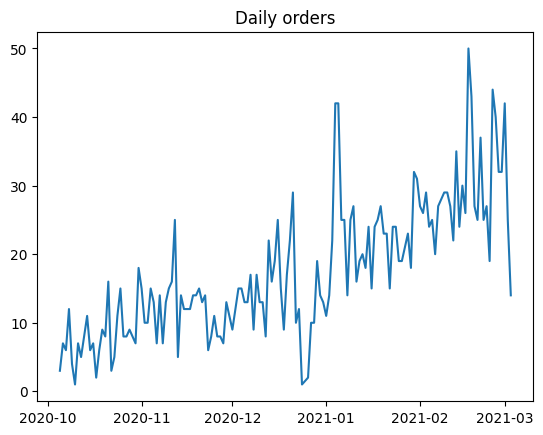
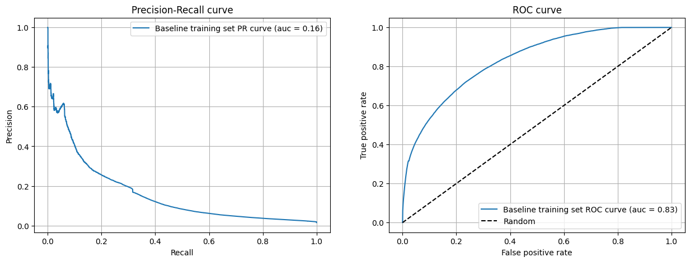
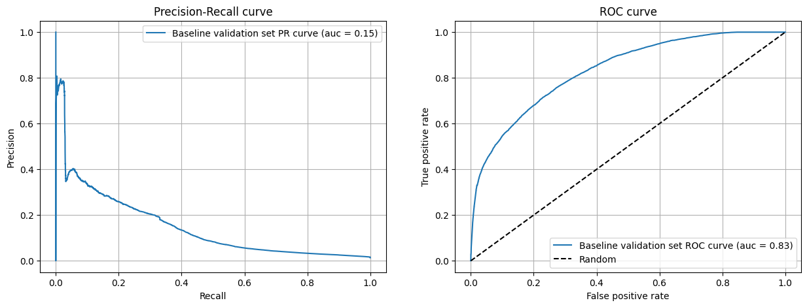
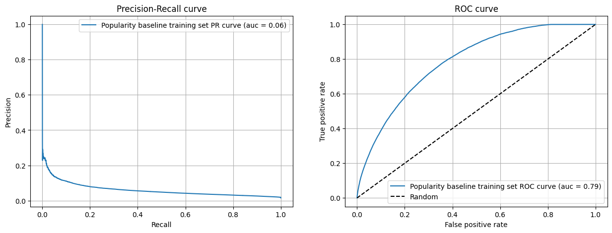
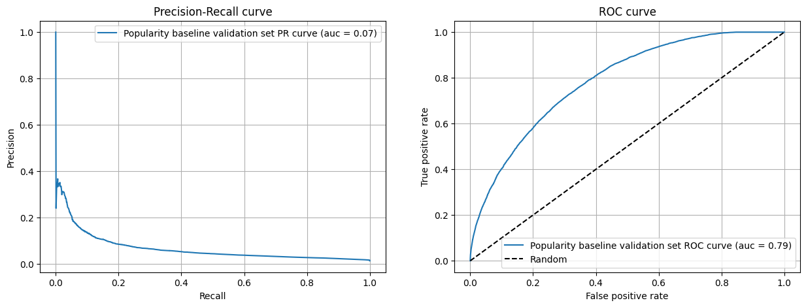
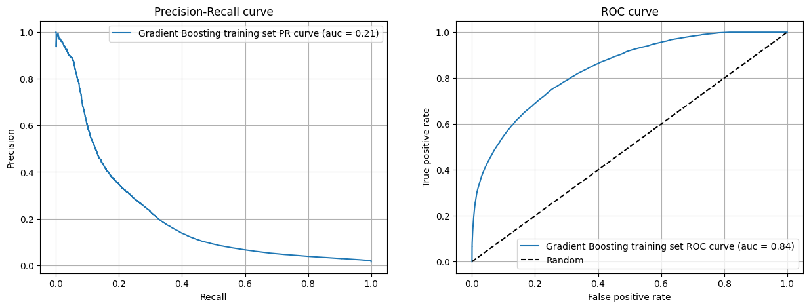
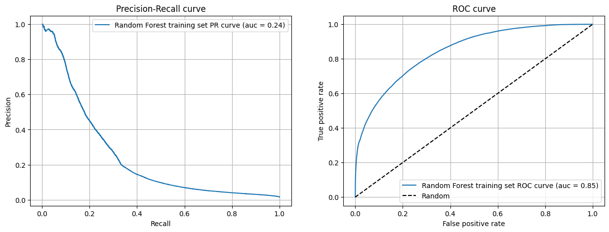
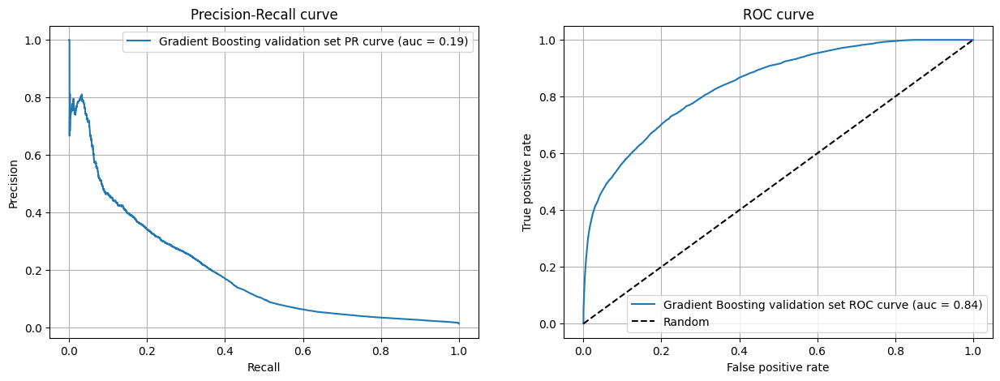
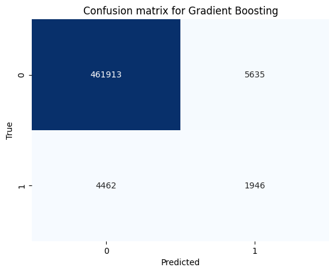
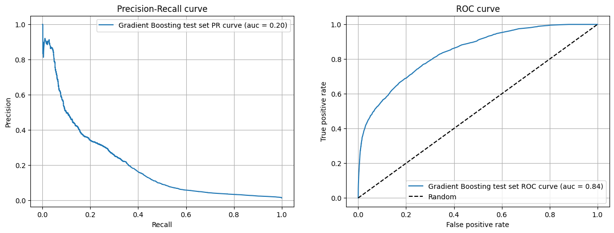

```python
import pandas as pd
import numpy as np
import matplotlib.pyplot as plt
import seaborn as sns
import matplotlib
from typing import Tuple

from sklearn. linear_model import LogisticRegression
from sklearn.metrics import precision_recall_curve, roc_curve, auc, average_precision_score
from sklearn.pipeline import make_pipeline
from sklearn.preprocessing import StandardScaler
```


```python
data_path = '../../data/box_builder_dataset/feature_frame.parquet'
df = pd.read_parquet(data_path)
```


```python
df.info()
```

    <class 'pandas.core.frame.DataFrame'>
    RangeIndex: 2880549 entries, 0 to 2880548
    Data columns (total 27 columns):
     #   Column                            Dtype  
    ---  ------                            -----  
     0   variant_id                        int64  
     1   product_type                      object 
     2   order_id                          int64  
     3   user_id                           int64  
     4   created_at                        object 
     5   order_date                        object 
     6   user_order_seq                    int64  
     7   outcome                           float64
     8   ordered_before                    float64
     9   abandoned_before                  float64
     10  active_snoozed                    float64
     11  set_as_regular                    float64
     12  normalised_price                  float64
     13  discount_pct                      float64
     14  vendor                            object 
     15  global_popularity                 float64
     16  count_adults                      float64
     17  count_children                    float64
     18  count_babies                      float64
     19  count_pets                        float64
     20  people_ex_baby                    float64
     21  days_since_purchase_variant_id    float64
     22  avg_days_to_buy_variant_id        float64
     23  std_days_to_buy_variant_id        float64
     24  days_since_purchase_product_type  float64
     25  avg_days_to_buy_product_type      float64
     26  std_days_to_buy_product_type      float64
    dtypes: float64(19), int64(4), object(4)
    memory usage: 593.4+ MB


```python
df.head()
```


<div>
<style scoped>
    .dataframe tbody tr th:only-of-type {
        vertical-align: middle;
    }

    .dataframe tbody tr th {
        vertical-align: top;
    }

    .dataframe thead th {
        text-align: right;
    }
</style>
<table border="1" class="dataframe">
  <thead>
    <tr style="text-align: right;">
      <th></th>
      <th>variant_id</th>
      <th>product_type</th>
      <th>order_id</th>
      <th>user_id</th>
      <th>created_at</th>
      <th>order_date</th>
      <th>user_order_seq</th>
      <th>outcome</th>
      <th>ordered_before</th>
      <th>abandoned_before</th>
      <th>...</th>
      <th>count_children</th>
      <th>count_babies</th>
      <th>count_pets</th>
      <th>people_ex_baby</th>
      <th>days_since_purchase_variant_id</th>
      <th>avg_days_to_buy_variant_id</th>
      <th>std_days_to_buy_variant_id</th>
      <th>days_since_purchase_product_type</th>
      <th>avg_days_to_buy_product_type</th>
      <th>std_days_to_buy_product_type</th>
    </tr>
  </thead>
  <tbody>
    <tr>
      <th>0</th>
      <td>33826472919172</td>
      <td>ricepastapulses</td>
      <td>2807985930372</td>
      <td>3482464092292</td>
      <td>2020-10-05 16:46:19</td>
      <td>2020-10-05 00:00:00</td>
      <td>3</td>
      <td>0.0</td>
      <td>0.0</td>
      <td>0.0</td>
      <td>...</td>
      <td>0.0</td>
      <td>0.0</td>
      <td>0.0</td>
      <td>2.0</td>
      <td>33.0</td>
      <td>42.0</td>
      <td>31.134053</td>
      <td>30.0</td>
      <td>30.0</td>
      <td>24.27618</td>
    </tr>
    <tr>
      <th>1</th>
      <td>33826472919172</td>
      <td>ricepastapulses</td>
      <td>2808027644036</td>
      <td>3466586718340</td>
      <td>2020-10-05 17:59:51</td>
      <td>2020-10-05 00:00:00</td>
      <td>2</td>
      <td>0.0</td>
      <td>0.0</td>
      <td>0.0</td>
      <td>...</td>
      <td>0.0</td>
      <td>0.0</td>
      <td>0.0</td>
      <td>2.0</td>
      <td>33.0</td>
      <td>42.0</td>
      <td>31.134053</td>
      <td>30.0</td>
      <td>30.0</td>
      <td>24.27618</td>
    </tr>
    <tr>
      <th>2</th>
      <td>33826472919172</td>
      <td>ricepastapulses</td>
      <td>2808099078276</td>
      <td>3481384026244</td>
      <td>2020-10-05 20:08:53</td>
      <td>2020-10-05 00:00:00</td>
      <td>4</td>
      <td>0.0</td>
      <td>0.0</td>
      <td>0.0</td>
      <td>...</td>
      <td>0.0</td>
      <td>0.0</td>
      <td>0.0</td>
      <td>2.0</td>
      <td>33.0</td>
      <td>42.0</td>
      <td>31.134053</td>
      <td>30.0</td>
      <td>30.0</td>
      <td>24.27618</td>
    </tr>
    <tr>
      <th>3</th>
      <td>33826472919172</td>
      <td>ricepastapulses</td>
      <td>2808393957508</td>
      <td>3291363377284</td>
      <td>2020-10-06 08:57:59</td>
      <td>2020-10-06 00:00:00</td>
      <td>2</td>
      <td>0.0</td>
      <td>0.0</td>
      <td>0.0</td>
      <td>...</td>
      <td>0.0</td>
      <td>0.0</td>
      <td>0.0</td>
      <td>2.0</td>
      <td>33.0</td>
      <td>42.0</td>
      <td>31.134053</td>
      <td>30.0</td>
      <td>30.0</td>
      <td>24.27618</td>
    </tr>
    <tr>
      <th>4</th>
      <td>33826472919172</td>
      <td>ricepastapulses</td>
      <td>2808429314180</td>
      <td>3537167515780</td>
      <td>2020-10-06 10:37:05</td>
      <td>2020-10-06 00:00:00</td>
      <td>3</td>
      <td>0.0</td>
      <td>0.0</td>
      <td>0.0</td>
      <td>...</td>
      <td>0.0</td>
      <td>0.0</td>
      <td>0.0</td>
      <td>2.0</td>
      <td>33.0</td>
      <td>42.0</td>
      <td>31.134053</td>
      <td>30.0</td>
      <td>30.0</td>
      <td>24.27618</td>
    </tr>
  </tbody>
</table>
<p>5 rows × 27 columns</p>
</div>


First of all, let's divide our columns into informative and features and definde de target variable.

After that, we are clasifying the columns into numerical, categorical and binary columns.


```python
info_cols = ['variant_id', 'order_id', 'user_id', 'created_at', 'order_date']
label_col = 'outcome'
features_cols = [col for col in df.columns if col not in info_cols + [label_col]]

categorical_cols = ['product_type', 'vendor']
binary_cols = ['ordered_before', 'abandoned_before', 'active_snoozed', 'set_as_regular']
numerical_cols = [col for col in features_cols if col not in categorical_cols + binary_cols]
```

We need only the orders with at least 5 items on them


```python
def get_relevant_dataframe(df: pd.DataFrame, min_products: int=5) -> pd.DataFrame:
    """We are only interested in big enough orders that are profitable"""
    order_sizes = df.groupby('order_id').outcome.sum()
    big_enough_orders = order_sizes[order_sizes >= min_products].index
    return df[df.order_id.isin(big_enough_orders)].copy()
```


```python
df_relevant = (
    df
    .pipe(get_relevant_dataframe)
    .assign(created_at=lambda x: pd.to_datetime(x.created_at))
    .assign(order_date=lambda x: pd.to_datetime(x.order_date).dt.date)
)
```

Let's check that we have a larger amount of data before filtering:


```python
df['order_id'].nunique() > df_relevant['order_id'].nunique()
```


    True


As there is a date variable, let's see if the data behaves differently in different periods of time.


```python
daily_orders = df_relevant.groupby('order_date').order_id.nunique()
```


```python
daily_orders.head()
```


    order_date
    2020-10-05     3
    2020-10-06     7
    2020-10-07     6
    2020-10-08    12
    2020-10-09     4
    Name: order_id, dtype: int64


```python
plt.plot(daily_orders, label='Daily orders')
plt.title('Daily orders')
```


    Text(0.5, 1.0, 'Daily orders')


    

    


As the number of orders is increasing over time, we will split the data into training and testing sets using a time-based split.

By doing this, we will be able to evaluate the model's performance on the most recent data and avoid data leakage.


```python
cumsum_daily_orders = daily_orders.cumsum() / daily_orders.sum()

train_val_cutoff = cumsum_daily_orders[cumsum_daily_orders <= 0.7].idxmax()
val_test_cutoff = cumsum_daily_orders[cumsum_daily_orders <= 0.9].idxmax()

print("Train since:", cumsum_daily_orders.index.min())
print("Train until:", train_val_cutoff)
print("Val until:", val_test_cutoff)
print("Test until:", cumsum_daily_orders.index.max())

```

    Train since: 2020-10-05
    Train until: 2021-02-04
    Val until: 2021-02-22
    Test until: 2021-03-03


```python
train_df = df_relevant[df_relevant.order_date <= train_val_cutoff]
val_df = df_relevant[(df_relevant.order_date > train_val_cutoff) & (df_relevant.order_date <= val_test_cutoff)]
test_df = df_relevant[df_relevant.order_date > val_test_cutoff]
```

## Baseline

To test the model, we will use the ROC curve and the precision-recall curve.


```python
def plot_metrics(
        model_name: str,
        y_pred: pd.Series,
        y_test: pd.Series,
        figure: Tuple[matplotlib.figure.Figure, np.array]=None
        ) -> None:
    if figure is None:
        fig, ax = plt.subplots(1, 2, figsize=(15, 5))
    else:
        fig, ax = figure
    precision, recall, _ = precision_recall_curve(y_test, y_pred)
    average_precision = average_precision_score(y_test, y_pred)
    fpr, tpr, _ = roc_curve(y_test, y_pred)
    roc_auc = auc(fpr, tpr)

    ax[0].plot(recall, precision, label=f'{model_name} PR curve (auc = {average_precision:0.2f})')
    ax[0].set_xlabel('Recall')
    ax[0].set_ylabel('Precision')
    ax[0].set_title('Precision-Recall curve')
    ax[0].legend()
    ax[0].grid()

    ax[1].plot(fpr, tpr, label=f'{model_name} ROC curve (auc = {roc_auc:0.2f})')
    ax[1].plot([0, 1], [0, 1], 'k--', label='Random')
    ax[1].set_xlabel('False positive rate')
    ax[1].set_ylabel('True positive rate')
    ax[1].set_title('ROC curve')
    ax[1].legend()
    ax[1].grid()
    plt.show()
```


```python
def feature_label_split(df: pd.DataFrame, label_col: str) -> Tuple[pd.DataFrame, pd.Series]:
    X = df.drop(label_col, axis=1)
    y = df[label_col]
    return X, y

X_train, y_train = feature_label_split(train_df, label_col)
X_val, y_val = feature_label_split(val_df, label_col)
X_test, y_test = feature_label_split(test_df, label_col)
```

In order to be able to understand if our model is performing well, we need to establish a baseline.

We are using the model created in the previous module as a baseline and we will compare the results with the new model. 

The previous model is a simple logistic regression model with the following features: 


```python
baseline_features = [
    'ordered_before',
    'abandoned_before',
    'global_popularity',
]

baseline_model = make_pipeline(
    StandardScaler(),
    LogisticRegression(penalty='l2', C=1.0)
)

baseline_model.fit(X_train[baseline_features], y_train)
```


<style>#sk-container-id-1 {
  /* Definition of color scheme common for light and dark mode */
  --sklearn-color-text: black;
  --sklearn-color-line: gray;
  /* Definition of color scheme for unfitted estimators */
  --sklearn-color-unfitted-level-0: #fff5e6;
  --sklearn-color-unfitted-level-1: #f6e4d2;
  --sklearn-color-unfitted-level-2: #ffe0b3;
  --sklearn-color-unfitted-level-3: chocolate;
  /* Definition of color scheme for fitted estimators */
  --sklearn-color-fitted-level-0: #f0f8ff;
  --sklearn-color-fitted-level-1: #d4ebff;
  --sklearn-color-fitted-level-2: #b3dbfd;
  --sklearn-color-fitted-level-3: cornflowerblue;

  /* Specific color for light theme */
  --sklearn-color-text-on-default-background: var(--sg-text-color, var(--theme-code-foreground, var(--jp-content-font-color1, black)));
  --sklearn-color-background: var(--sg-background-color, var(--theme-background, var(--jp-layout-color0, white)));
  --sklearn-color-border-box: var(--sg-text-color, var(--theme-code-foreground, var(--jp-content-font-color1, black)));
  --sklearn-color-icon: #696969;

  @media (prefers-color-scheme: dark) {
    /* Redefinition of color scheme for dark theme */
    --sklearn-color-text-on-default-background: var(--sg-text-color, var(--theme-code-foreground, var(--jp-content-font-color1, white)));
    --sklearn-color-background: var(--sg-background-color, var(--theme-background, var(--jp-layout-color0, #111)));
    --sklearn-color-border-box: var(--sg-text-color, var(--theme-code-foreground, var(--jp-content-font-color1, white)));
    --sklearn-color-icon: #878787;
  }
}

#sk-container-id-1 {
  color: var(--sklearn-color-text);
}

#sk-container-id-1 pre {
  padding: 0;
}

#sk-container-id-1 input.sk-hidden--visually {
  border: 0;
  clip: rect(1px 1px 1px 1px);
  clip: rect(1px, 1px, 1px, 1px);
  height: 1px;
  margin: -1px;
  overflow: hidden;
  padding: 0;
  position: absolute;
  width: 1px;
}

#sk-container-id-1 div.sk-dashed-wrapped {
  border: 1px dashed var(--sklearn-color-line);
  margin: 0 0.4em 0.5em 0.4em;
  box-sizing: border-box;
  padding-bottom: 0.4em;
  background-color: var(--sklearn-color-background);
}

#sk-container-id-1 div.sk-container {
  /* jupyter's `normalize.less` sets `[hidden] { display: none; }`
     but bootstrap.min.css set `[hidden] { display: none !important; }`
     so we also need the `!important` here to be able to override the
     default hidden behavior on the sphinx rendered scikit-learn.org.
     See: https://github.com/scikit-learn/scikit-learn/issues/21755 */
  display: inline-block !important;
  position: relative;
}

#sk-container-id-1 div.sk-text-repr-fallback {
  display: none;
}

div.sk-parallel-item,
div.sk-serial,
div.sk-item {
  /* draw centered vertical line to link estimators */
  background-image: linear-gradient(var(--sklearn-color-text-on-default-background), var(--sklearn-color-text-on-default-background));
  background-size: 2px 100%;
  background-repeat: no-repeat;
  background-position: center center;
}

/* Parallel-specific style estimator block */

#sk-container-id-1 div.sk-parallel-item::after {
  content: "";
  width: 100%;
  border-bottom: 2px solid var(--sklearn-color-text-on-default-background);
  flex-grow: 1;
}

#sk-container-id-1 div.sk-parallel {
  display: flex;
  align-items: stretch;
  justify-content: center;
  background-color: var(--sklearn-color-background);
  position: relative;
}

#sk-container-id-1 div.sk-parallel-item {
  display: flex;
  flex-direction: column;
}

#sk-container-id-1 div.sk-parallel-item:first-child::after {
  align-self: flex-end;
  width: 50%;
}

#sk-container-id-1 div.sk-parallel-item:last-child::after {
  align-self: flex-start;
  width: 50%;
}

#sk-container-id-1 div.sk-parallel-item:only-child::after {
  width: 0;
}

/* Serial-specific style estimator block */

#sk-container-id-1 div.sk-serial {
  display: flex;
  flex-direction: column;
  align-items: center;
  background-color: var(--sklearn-color-background);
  padding-right: 1em;
  padding-left: 1em;
}


/* Toggleable style: style used for estimator/Pipeline/ColumnTransformer box that is
clickable and can be expanded/collapsed.
- Pipeline and ColumnTransformer use this feature and define the default style
- Estimators will overwrite some part of the style using the `sk-estimator` class
*/

/* Pipeline and ColumnTransformer style (default) */

#sk-container-id-1 div.sk-toggleable {
  /* Default theme specific background. It is overwritten whether we have a
  specific estimator or a Pipeline/ColumnTransformer */
  background-color: var(--sklearn-color-background);
}

/* Toggleable label */
#sk-container-id-1 label.sk-toggleable__label {
  cursor: pointer;
  display: block;
  width: 100%;
  margin-bottom: 0;
  padding: 0.5em;
  box-sizing: border-box;
  text-align: center;
}

#sk-container-id-1 label.sk-toggleable__label-arrow:before {
  /* Arrow on the left of the label */
  content: "▸";
  float: left;
  margin-right: 0.25em;
  color: var(--sklearn-color-icon);
}

#sk-container-id-1 label.sk-toggleable__label-arrow:hover:before {
  color: var(--sklearn-color-text);
}

/* Toggleable content - dropdown */

#sk-container-id-1 div.sk-toggleable__content {
  max-height: 0;
  max-width: 0;
  overflow: hidden;
  text-align: left;
  /* unfitted */
  background-color: var(--sklearn-color-unfitted-level-0);
}

#sk-container-id-1 div.sk-toggleable__content.fitted {
  /* fitted */
  background-color: var(--sklearn-color-fitted-level-0);
}

#sk-container-id-1 div.sk-toggleable__content pre {
  margin: 0.2em;
  border-radius: 0.25em;
  color: var(--sklearn-color-text);
  /* unfitted */
  background-color: var(--sklearn-color-unfitted-level-0);
}

#sk-container-id-1 div.sk-toggleable__content.fitted pre {
  /* unfitted */
  background-color: var(--sklearn-color-fitted-level-0);
}

#sk-container-id-1 input.sk-toggleable__control:checked~div.sk-toggleable__content {
  /* Expand drop-down */
  max-height: 200px;
  max-width: 100%;
  overflow: auto;
}

#sk-container-id-1 input.sk-toggleable__control:checked~label.sk-toggleable__label-arrow:before {
  content: "▾";
}

/* Pipeline/ColumnTransformer-specific style */

#sk-container-id-1 div.sk-label input.sk-toggleable__control:checked~label.sk-toggleable__label {
  color: var(--sklearn-color-text);
  background-color: var(--sklearn-color-unfitted-level-2);
}

#sk-container-id-1 div.sk-label.fitted input.sk-toggleable__control:checked~label.sk-toggleable__label {
  background-color: var(--sklearn-color-fitted-level-2);
}

/* Estimator-specific style */

/* Colorize estimator box */
#sk-container-id-1 div.sk-estimator input.sk-toggleable__control:checked~label.sk-toggleable__label {
  /* unfitted */
  background-color: var(--sklearn-color-unfitted-level-2);
}

#sk-container-id-1 div.sk-estimator.fitted input.sk-toggleable__control:checked~label.sk-toggleable__label {
  /* fitted */
  background-color: var(--sklearn-color-fitted-level-2);
}

#sk-container-id-1 div.sk-label label.sk-toggleable__label,
#sk-container-id-1 div.sk-label label {
  /* The background is the default theme color */
  color: var(--sklearn-color-text-on-default-background);
}

/* On hover, darken the color of the background */
#sk-container-id-1 div.sk-label:hover label.sk-toggleable__label {
  color: var(--sklearn-color-text);
  background-color: var(--sklearn-color-unfitted-level-2);
}

/* Label box, darken color on hover, fitted */
#sk-container-id-1 div.sk-label.fitted:hover label.sk-toggleable__label.fitted {
  color: var(--sklearn-color-text);
  background-color: var(--sklearn-color-fitted-level-2);
}

/* Estimator label */

#sk-container-id-1 div.sk-label label {
  font-family: monospace;
  font-weight: bold;
  display: inline-block;
  line-height: 1.2em;
}

#sk-container-id-1 div.sk-label-container {
  text-align: center;
}

/* Estimator-specific */
#sk-container-id-1 div.sk-estimator {
  font-family: monospace;
  border: 1px dotted var(--sklearn-color-border-box);
  border-radius: 0.25em;
  box-sizing: border-box;
  margin-bottom: 0.5em;
  /* unfitted */
  background-color: var(--sklearn-color-unfitted-level-0);
}

#sk-container-id-1 div.sk-estimator.fitted {
  /* fitted */
  background-color: var(--sklearn-color-fitted-level-0);
}

/* on hover */
#sk-container-id-1 div.sk-estimator:hover {
  /* unfitted */
  background-color: var(--sklearn-color-unfitted-level-2);
}

#sk-container-id-1 div.sk-estimator.fitted:hover {
  /* fitted */
  background-color: var(--sklearn-color-fitted-level-2);
}

/* Specification for estimator info (e.g. "i" and "?") */

/* Common style for "i" and "?" */

.sk-estimator-doc-link,
a:link.sk-estimator-doc-link,
a:visited.sk-estimator-doc-link {
  float: right;
  font-size: smaller;
  line-height: 1em;
  font-family: monospace;
  background-color: var(--sklearn-color-background);
  border-radius: 1em;
  height: 1em;
  width: 1em;
  text-decoration: none !important;
  margin-left: 1ex;
  /* unfitted */
  border: var(--sklearn-color-unfitted-level-1) 1pt solid;
  color: var(--sklearn-color-unfitted-level-1);
}

.sk-estimator-doc-link.fitted,
a:link.sk-estimator-doc-link.fitted,
a:visited.sk-estimator-doc-link.fitted {
  /* fitted */
  border: var(--sklearn-color-fitted-level-1) 1pt solid;
  color: var(--sklearn-color-fitted-level-1);
}

/* On hover */
div.sk-estimator:hover .sk-estimator-doc-link:hover,
.sk-estimator-doc-link:hover,
div.sk-label-container:hover .sk-estimator-doc-link:hover,
.sk-estimator-doc-link:hover {
  /* unfitted */
  background-color: var(--sklearn-color-unfitted-level-3);
  color: var(--sklearn-color-background);
  text-decoration: none;
}

div.sk-estimator.fitted:hover .sk-estimator-doc-link.fitted:hover,
.sk-estimator-doc-link.fitted:hover,
div.sk-label-container:hover .sk-estimator-doc-link.fitted:hover,
.sk-estimator-doc-link.fitted:hover {
  /* fitted */
  background-color: var(--sklearn-color-fitted-level-3);
  color: var(--sklearn-color-background);
  text-decoration: none;
}

/* Span, style for the box shown on hovering the info icon */
.sk-estimator-doc-link span {
  display: none;
  z-index: 9999;
  position: relative;
  font-weight: normal;
  right: .2ex;
  padding: .5ex;
  margin: .5ex;
  width: min-content;
  min-width: 20ex;
  max-width: 50ex;
  color: var(--sklearn-color-text);
  box-shadow: 2pt 2pt 4pt #999;
  /* unfitted */
  background: var(--sklearn-color-unfitted-level-0);
  border: .5pt solid var(--sklearn-color-unfitted-level-3);
}

.sk-estimator-doc-link.fitted span {
  /* fitted */
  background: var(--sklearn-color-fitted-level-0);
  border: var(--sklearn-color-fitted-level-3);
}

.sk-estimator-doc-link:hover span {
  display: block;
}

/* "?"-specific style due to the `<a>` HTML tag */

#sk-container-id-1 a.estimator_doc_link {
  float: right;
  font-size: 1rem;
  line-height: 1em;
  font-family: monospace;
  background-color: var(--sklearn-color-background);
  border-radius: 1rem;
  height: 1rem;
  width: 1rem;
  text-decoration: none;
  /* unfitted */
  color: var(--sklearn-color-unfitted-level-1);
  border: var(--sklearn-color-unfitted-level-1) 1pt solid;
}

#sk-container-id-1 a.estimator_doc_link.fitted {
  /* fitted */
  border: var(--sklearn-color-fitted-level-1) 1pt solid;
  color: var(--sklearn-color-fitted-level-1);
}

/* On hover */
#sk-container-id-1 a.estimator_doc_link:hover {
  /* unfitted */
  background-color: var(--sklearn-color-unfitted-level-3);
  color: var(--sklearn-color-background);
  text-decoration: none;
}

#sk-container-id-1 a.estimator_doc_link.fitted:hover {
  /* fitted */
  background-color: var(--sklearn-color-fitted-level-3);
}
</style><div id="sk-container-id-1" class="sk-top-container"><div class="sk-text-repr-fallback"><pre>Pipeline(steps=[(&#x27;standardscaler&#x27;, StandardScaler()),
                (&#x27;logisticregression&#x27;, LogisticRegression())])</pre><b>In a Jupyter environment, please rerun this cell to show the HTML representation or trust the notebook. <br />On GitHub, the HTML representation is unable to render, please try loading this page with nbviewer.org.</b></div><div class="sk-container" hidden><div class="sk-item sk-dashed-wrapped"><div class="sk-label-container"><div class="sk-label fitted sk-toggleable"><input class="sk-toggleable__control sk-hidden--visually" id="sk-estimator-id-1" type="checkbox" ><label for="sk-estimator-id-1" class="sk-toggleable__label fitted sk-toggleable__label-arrow fitted">&nbsp;&nbsp;Pipeline<a class="sk-estimator-doc-link fitted" rel="noreferrer" target="_blank" href="https://scikit-learn.org/1.4/modules/generated/sklearn.pipeline.Pipeline.html">?<span>Documentation for Pipeline</span></a><span class="sk-estimator-doc-link fitted">i<span>Fitted</span></span></label><div class="sk-toggleable__content fitted"><pre>Pipeline(steps=[(&#x27;standardscaler&#x27;, StandardScaler()),
                (&#x27;logisticregression&#x27;, LogisticRegression())])</pre></div> </div></div><div class="sk-serial"><div class="sk-item"><div class="sk-estimator fitted sk-toggleable"><input class="sk-toggleable__control sk-hidden--visually" id="sk-estimator-id-2" type="checkbox" ><label for="sk-estimator-id-2" class="sk-toggleable__label fitted sk-toggleable__label-arrow fitted">&nbsp;StandardScaler<a class="sk-estimator-doc-link fitted" rel="noreferrer" target="_blank" href="https://scikit-learn.org/1.4/modules/generated/sklearn.preprocessing.StandardScaler.html">?<span>Documentation for StandardScaler</span></a></label><div class="sk-toggleable__content fitted"><pre>StandardScaler()</pre></div> </div></div><div class="sk-item"><div class="sk-estimator fitted sk-toggleable"><input class="sk-toggleable__control sk-hidden--visually" id="sk-estimator-id-3" type="checkbox" ><label for="sk-estimator-id-3" class="sk-toggleable__label fitted sk-toggleable__label-arrow fitted">&nbsp;LogisticRegression<a class="sk-estimator-doc-link fitted" rel="noreferrer" target="_blank" href="https://scikit-learn.org/1.4/modules/generated/sklearn.linear_model.LogisticRegression.html">?<span>Documentation for LogisticRegression</span></a></label><div class="sk-toggleable__content fitted"><pre>LogisticRegression()</pre></div> </div></div></div></div></div></div>


```python
train_prob = baseline_model.predict_proba(X_train[baseline_features])[:, 1]
plot_metrics('Baseline training set', train_prob, y_train)

val_prob = baseline_model.predict_proba(X_val[baseline_features])[:, 1]
plot_metrics('Baseline validation set', val_prob, y_val)
```


    

    


    

    


We can also use a simplier baseline by using the `global_popularity` variable as a predictor.


```python
plot_metrics('Popularity baseline training set', train_df['global_popularity'], y_train)
plot_metrics('Popularity baseline validation set', val_df['global_popularity'], y_val)
```


    

    


    

    


Let's see if we can improve the baseline model by using a non linear model. Let's try a Random Forest model.


```python
def print_model_metrics(model_name: str, y_true: pd.Series, y_pred: pd.Series) -> None:
    precision, recall, _ = precision_recall_curve(y_true, y_pred)
    average_precision = average_precision_score(y_true, y_pred)
    max_f1 = np.max(2 * precision * recall / (precision + recall))
    fpr, tpr, _ = roc_curve(y_true, y_pred)
    roc_auc = auc(fpr, tpr)
    print(f'{model_name}:\t PR curve auc = {average_precision:0.5f}.\t Best F1 score: {max_f1:0.5f}.\t ROC curve auc = {roc_auc:0.5f}.')
```

Now we're defining the features that will help us to predict the target variable.


```python
train_cols = numerical_cols + binary_cols
```


```python
from sklearn.ensemble import RandomForestClassifier
```


```python
n_estimators = [5, 10, 20, 50, 100]
for n in n_estimators:
    for max_depth in [None, 5, 10, 20]:
        random_forest_model = RandomForestClassifier(n_estimators=n, max_depth=max_depth, n_jobs=2)

        random_forest_model.fit(X_train[train_cols], y_train)
        val_prob = random_forest_model.predict_proba(X_val[train_cols])[:, 1]

        print_model_metrics(f'Random Forest n={n} max_depth={max_depth} validation set', y_val, val_prob)
```

    Random Forest n=5 max_depth=None validation set:	 PR curve auc = 0.07622.	 Best F1 score: 0.17141.	 ROC curve auc = 0.64707.
    Random Forest n=5 max_depth=5 validation set:	 PR curve auc = 0.17462.	 Best F1 score: 0.26472.	 ROC curve auc = 0.80576.
    Random Forest n=5 max_depth=10 validation set:	 PR curve auc = 0.18068.	 Best F1 score: 0.26323.	 ROC curve auc = 0.83089.
    Random Forest n=5 max_depth=20 validation set:	 PR curve auc = 0.13667.	 Best F1 score: 0.21533.	 ROC curve auc = 0.80146.
    Random Forest n=10 max_depth=None validation set:	 PR curve auc = 0.09114.	 Best F1 score: 0.17948.	 ROC curve auc = 0.67988.
    Random Forest n=10 max_depth=5 validation set:	 PR curve auc = 0.18800.	 Best F1 score: 0.27624.	 ROC curve auc = 0.83004.
    Random Forest n=10 max_depth=10 validation set:	 PR curve auc = 0.19407.	 Best F1 score: 0.27567.	 ROC curve auc = 0.83862.
    Random Forest n=10 max_depth=20 validation set:	 PR curve auc = 0.15756.	 Best F1 score: 0.23524.	 ROC curve auc = 0.82519.
    Random Forest n=20 max_depth=None validation set:	 PR curve auc = 0.11284.	 Best F1 score: 0.19287.	 ROC curve auc = 0.70715.
    Random Forest n=20 max_depth=5 validation set:	 PR curve auc = 0.19100.	 Best F1 score: 0.27297.	 ROC curve auc = 0.83203.
    Random Forest n=20 max_depth=10 validation set:	 PR curve auc = 0.19655.	 Best F1 score: 0.28119.	 ROC curve auc = 0.84104.
    Random Forest n=20 max_depth=20 validation set:	 PR curve auc = 0.17445.	 Best F1 score: 0.25331.	 ROC curve auc = 0.83319.
    Random Forest n=50 max_depth=None validation set:	 PR curve auc = 0.12030.	 Best F1 score: 0.19368.	 ROC curve auc = 0.73688.
    Random Forest n=50 max_depth=5 validation set:	 PR curve auc = 0.19255.	 Best F1 score: 0.27397.	 ROC curve auc = 0.83373.
    Random Forest n=50 max_depth=10 validation set:	 PR curve auc = 0.19828.	 Best F1 score: 0.28099.	 ROC curve auc = 0.84118.
    Random Forest n=50 max_depth=20 validation set:	 PR curve auc = 0.17715.	 Best F1 score: 0.25700.	 ROC curve auc = 0.83854.
    Random Forest n=100 max_depth=None validation set:	 PR curve auc = 0.12363.	 Best F1 score: 0.20003.	 ROC curve auc = 0.74569.
    Random Forest n=100 max_depth=5 validation set:	 PR curve auc = 0.19421.	 Best F1 score: 0.27703.	 ROC curve auc = 0.83281.
    Random Forest n=100 max_depth=10 validation set:	 PR curve auc = 0.20037.	 Best F1 score: 0.28470.	 ROC curve auc = 0.84367.
    Random Forest n=100 max_depth=20 validation set:	 PR curve auc = 0.17990.	 Best F1 score: 0.26243.	 ROC curve auc = 0.84075.


The best results come from the Random Forest model with n=100 and max_depth=10.

There is another model that performs very similar, the one with n=50 and max_depth=10.

I will choose the model with n=50 and max_depth=10 as the final model for simplicity.


Now let's try to improve the model by using a Gradient Boosting Tree model.


```python
from sklearn.ensemble import GradientBoostingClassifier
```


```python
n_estimators = [20, 50, 100]
for learning_rate in [0.1, 0.05]:
    for depth in [1, 3, 5]:
        for n in n_estimators:
            gradient_boosting_model = GradientBoostingClassifier(n_estimators=n, learning_rate=learning_rate, max_depth=depth)

            gradient_boosting_model.fit(X_train[train_cols], y_train)
            val_prob = gradient_boosting_model.predict_proba(X_val[train_cols])[:, 1]

            print_model_metrics(f'Gradient Boosting n_estimators={n} learning_rate={learning_rate} depth={depth} validation set', y_val, val_prob)

```

    Gradient Boosting n_estimators=20 learning_rate=0.1 depth=1 validation set:	 PR curve auc = 0.13958.	 Best F1 score: 0.24327.	 ROC curve auc = 0.80223.
    Gradient Boosting n_estimators=50 learning_rate=0.1 depth=1 validation set:	 PR curve auc = 0.16242.	 Best F1 score: 0.25221.	 ROC curve auc = 0.83531.
    Gradient Boosting n_estimators=100 learning_rate=0.1 depth=1 validation set:	 PR curve auc = 0.16960.	 Best F1 score: 0.25247.	 ROC curve auc = 0.83936.
    Gradient Boosting n_estimators=20 learning_rate=0.1 depth=3 validation set:	 PR curve auc = 0.18212.	 Best F1 score: 0.26614.	 ROC curve auc = 0.84133.
    Gradient Boosting n_estimators=50 learning_rate=0.1 depth=3 validation set:	 PR curve auc = 0.18742.	 Best F1 score: 0.27205.	 ROC curve auc = 0.84389.
    Gradient Boosting n_estimators=100 learning_rate=0.1 depth=3 validation set:	 PR curve auc = 0.18778.	 Best F1 score: 0.27428.	 ROC curve auc = 0.84626.
    Gradient Boosting n_estimators=20 learning_rate=0.1 depth=5 validation set:	 PR curve auc = 0.18888.	 Best F1 score: 0.27503.	 ROC curve auc = 0.84444.


    /tmp/ipykernel_3340/4145920766.py:4: RuntimeWarning: invalid value encountered in divide
      max_f1 = np.max(2 * precision * recall / (precision + recall))


    Gradient Boosting n_estimators=50 learning_rate=0.1 depth=5 validation set:	 PR curve auc = 0.17875.	 Best F1 score: nan.	 ROC curve auc = 0.84680.


    /tmp/ipykernel_3340/4145920766.py:4: RuntimeWarning: invalid value encountered in divide
      max_f1 = np.max(2 * precision * recall / (precision + recall))


    Gradient Boosting n_estimators=100 learning_rate=0.1 depth=5 validation set:	 PR curve auc = 0.17674.	 Best F1 score: nan.	 ROC curve auc = 0.84651.
    Gradient Boosting n_estimators=20 learning_rate=0.05 depth=1 validation set:	 PR curve auc = 0.10922.	 Best F1 score: 0.23541.	 ROC curve auc = 0.74125.
    Gradient Boosting n_estimators=50 learning_rate=0.05 depth=1 validation set:	 PR curve auc = 0.14177.	 Best F1 score: 0.24530.	 ROC curve auc = 0.81091.
    Gradient Boosting n_estimators=100 learning_rate=0.05 depth=1 validation set:	 PR curve auc = 0.16282.	 Best F1 score: 0.25202.	 ROC curve auc = 0.83127.
    Gradient Boosting n_estimators=20 learning_rate=0.05 depth=3 validation set:	 PR curve auc = 0.16421.	 Best F1 score: 0.25265.	 ROC curve auc = 0.82257.
    Gradient Boosting n_estimators=50 learning_rate=0.05 depth=3 validation set:	 PR curve auc = 0.18644.	 Best F1 score: 0.27224.	 ROC curve auc = 0.84078.
    Gradient Boosting n_estimators=100 learning_rate=0.05 depth=3 validation set:	 PR curve auc = 0.19093.	 Best F1 score: 0.27657.	 ROC curve auc = 0.84395.
    Gradient Boosting n_estimators=20 learning_rate=0.05 depth=5 validation set:	 PR curve auc = 0.18116.	 Best F1 score: 0.27142.	 ROC curve auc = 0.84149.
    Gradient Boosting n_estimators=50 learning_rate=0.05 depth=5 validation set:	 PR curve auc = 0.19229.	 Best F1 score: 0.27832.	 ROC curve auc = 0.84424.
    Gradient Boosting n_estimators=100 learning_rate=0.05 depth=5 validation set:	 PR curve auc = 0.19156.	 Best F1 score: nan.	 ROC curve auc = 0.84677.


    /tmp/ipykernel_3340/4145920766.py:4: RuntimeWarning: invalid value encountered in divide
      max_f1 = np.max(2 * precision * recall / (precision + recall))


The best results come from the Gradient Boosting Tree model with n_estimators=50 learning_rate=0.05 depth=5,
followed by the model with n_estimators=100 learning_rate=0.05 depth=5.

I will choose the model with n_estimators=50 learning_rate=0.05 depth=5 as the representative model for the Gradient Boosting Tree model, as it gives the best results and is simpler.

Now let's get the tree models and compare them to the baseline models


```python
gradient_boosting_model = GradientBoostingClassifier(n_estimators=50, learning_rate=0.05, max_depth=5)
gradient_boosting_model.fit(X_train[train_cols], y_train)

random_forest_model = RandomForestClassifier(n_estimators=50, max_depth=10)
random_forest_model.fit(X_train[train_cols], y_train)
```


<style>#sk-container-id-2 {
  /* Definition of color scheme common for light and dark mode */
  --sklearn-color-text: black;
  --sklearn-color-line: gray;
  /* Definition of color scheme for unfitted estimators */
  --sklearn-color-unfitted-level-0: #fff5e6;
  --sklearn-color-unfitted-level-1: #f6e4d2;
  --sklearn-color-unfitted-level-2: #ffe0b3;
  --sklearn-color-unfitted-level-3: chocolate;
  /* Definition of color scheme for fitted estimators */
  --sklearn-color-fitted-level-0: #f0f8ff;
  --sklearn-color-fitted-level-1: #d4ebff;
  --sklearn-color-fitted-level-2: #b3dbfd;
  --sklearn-color-fitted-level-3: cornflowerblue;

  /* Specific color for light theme */
  --sklearn-color-text-on-default-background: var(--sg-text-color, var(--theme-code-foreground, var(--jp-content-font-color1, black)));
  --sklearn-color-background: var(--sg-background-color, var(--theme-background, var(--jp-layout-color0, white)));
  --sklearn-color-border-box: var(--sg-text-color, var(--theme-code-foreground, var(--jp-content-font-color1, black)));
  --sklearn-color-icon: #696969;

  @media (prefers-color-scheme: dark) {
    /* Redefinition of color scheme for dark theme */
    --sklearn-color-text-on-default-background: var(--sg-text-color, var(--theme-code-foreground, var(--jp-content-font-color1, white)));
    --sklearn-color-background: var(--sg-background-color, var(--theme-background, var(--jp-layout-color0, #111)));
    --sklearn-color-border-box: var(--sg-text-color, var(--theme-code-foreground, var(--jp-content-font-color1, white)));
    --sklearn-color-icon: #878787;
  }
}

#sk-container-id-2 {
  color: var(--sklearn-color-text);
}

#sk-container-id-2 pre {
  padding: 0;
}

#sk-container-id-2 input.sk-hidden--visually {
  border: 0;
  clip: rect(1px 1px 1px 1px);
  clip: rect(1px, 1px, 1px, 1px);
  height: 1px;
  margin: -1px;
  overflow: hidden;
  padding: 0;
  position: absolute;
  width: 1px;
}

#sk-container-id-2 div.sk-dashed-wrapped {
  border: 1px dashed var(--sklearn-color-line);
  margin: 0 0.4em 0.5em 0.4em;
  box-sizing: border-box;
  padding-bottom: 0.4em;
  background-color: var(--sklearn-color-background);
}

#sk-container-id-2 div.sk-container {
  /* jupyter's `normalize.less` sets `[hidden] { display: none; }`
     but bootstrap.min.css set `[hidden] { display: none !important; }`
     so we also need the `!important` here to be able to override the
     default hidden behavior on the sphinx rendered scikit-learn.org.
     See: https://github.com/scikit-learn/scikit-learn/issues/21755 */
  display: inline-block !important;
  position: relative;
}

#sk-container-id-2 div.sk-text-repr-fallback {
  display: none;
}

div.sk-parallel-item,
div.sk-serial,
div.sk-item {
  /* draw centered vertical line to link estimators */
  background-image: linear-gradient(var(--sklearn-color-text-on-default-background), var(--sklearn-color-text-on-default-background));
  background-size: 2px 100%;
  background-repeat: no-repeat;
  background-position: center center;
}

/* Parallel-specific style estimator block */

#sk-container-id-2 div.sk-parallel-item::after {
  content: "";
  width: 100%;
  border-bottom: 2px solid var(--sklearn-color-text-on-default-background);
  flex-grow: 1;
}

#sk-container-id-2 div.sk-parallel {
  display: flex;
  align-items: stretch;
  justify-content: center;
  background-color: var(--sklearn-color-background);
  position: relative;
}

#sk-container-id-2 div.sk-parallel-item {
  display: flex;
  flex-direction: column;
}

#sk-container-id-2 div.sk-parallel-item:first-child::after {
  align-self: flex-end;
  width: 50%;
}

#sk-container-id-2 div.sk-parallel-item:last-child::after {
  align-self: flex-start;
  width: 50%;
}

#sk-container-id-2 div.sk-parallel-item:only-child::after {
  width: 0;
}

/* Serial-specific style estimator block */

#sk-container-id-2 div.sk-serial {
  display: flex;
  flex-direction: column;
  align-items: center;
  background-color: var(--sklearn-color-background);
  padding-right: 1em;
  padding-left: 1em;
}


/* Toggleable style: style used for estimator/Pipeline/ColumnTransformer box that is
clickable and can be expanded/collapsed.
- Pipeline and ColumnTransformer use this feature and define the default style
- Estimators will overwrite some part of the style using the `sk-estimator` class
*/

/* Pipeline and ColumnTransformer style (default) */

#sk-container-id-2 div.sk-toggleable {
  /* Default theme specific background. It is overwritten whether we have a
  specific estimator or a Pipeline/ColumnTransformer */
  background-color: var(--sklearn-color-background);
}

/* Toggleable label */
#sk-container-id-2 label.sk-toggleable__label {
  cursor: pointer;
  display: block;
  width: 100%;
  margin-bottom: 0;
  padding: 0.5em;
  box-sizing: border-box;
  text-align: center;
}

#sk-container-id-2 label.sk-toggleable__label-arrow:before {
  /* Arrow on the left of the label */
  content: "▸";
  float: left;
  margin-right: 0.25em;
  color: var(--sklearn-color-icon);
}

#sk-container-id-2 label.sk-toggleable__label-arrow:hover:before {
  color: var(--sklearn-color-text);
}

/* Toggleable content - dropdown */

#sk-container-id-2 div.sk-toggleable__content {
  max-height: 0;
  max-width: 0;
  overflow: hidden;
  text-align: left;
  /* unfitted */
  background-color: var(--sklearn-color-unfitted-level-0);
}

#sk-container-id-2 div.sk-toggleable__content.fitted {
  /* fitted */
  background-color: var(--sklearn-color-fitted-level-0);
}

#sk-container-id-2 div.sk-toggleable__content pre {
  margin: 0.2em;
  border-radius: 0.25em;
  color: var(--sklearn-color-text);
  /* unfitted */
  background-color: var(--sklearn-color-unfitted-level-0);
}

#sk-container-id-2 div.sk-toggleable__content.fitted pre {
  /* unfitted */
  background-color: var(--sklearn-color-fitted-level-0);
}

#sk-container-id-2 input.sk-toggleable__control:checked~div.sk-toggleable__content {
  /* Expand drop-down */
  max-height: 200px;
  max-width: 100%;
  overflow: auto;
}

#sk-container-id-2 input.sk-toggleable__control:checked~label.sk-toggleable__label-arrow:before {
  content: "▾";
}

/* Pipeline/ColumnTransformer-specific style */

#sk-container-id-2 div.sk-label input.sk-toggleable__control:checked~label.sk-toggleable__label {
  color: var(--sklearn-color-text);
  background-color: var(--sklearn-color-unfitted-level-2);
}

#sk-container-id-2 div.sk-label.fitted input.sk-toggleable__control:checked~label.sk-toggleable__label {
  background-color: var(--sklearn-color-fitted-level-2);
}

/* Estimator-specific style */

/* Colorize estimator box */
#sk-container-id-2 div.sk-estimator input.sk-toggleable__control:checked~label.sk-toggleable__label {
  /* unfitted */
  background-color: var(--sklearn-color-unfitted-level-2);
}

#sk-container-id-2 div.sk-estimator.fitted input.sk-toggleable__control:checked~label.sk-toggleable__label {
  /* fitted */
  background-color: var(--sklearn-color-fitted-level-2);
}

#sk-container-id-2 div.sk-label label.sk-toggleable__label,
#sk-container-id-2 div.sk-label label {
  /* The background is the default theme color */
  color: var(--sklearn-color-text-on-default-background);
}

/* On hover, darken the color of the background */
#sk-container-id-2 div.sk-label:hover label.sk-toggleable__label {
  color: var(--sklearn-color-text);
  background-color: var(--sklearn-color-unfitted-level-2);
}

/* Label box, darken color on hover, fitted */
#sk-container-id-2 div.sk-label.fitted:hover label.sk-toggleable__label.fitted {
  color: var(--sklearn-color-text);
  background-color: var(--sklearn-color-fitted-level-2);
}

/* Estimator label */

#sk-container-id-2 div.sk-label label {
  font-family: monospace;
  font-weight: bold;
  display: inline-block;
  line-height: 1.2em;
}

#sk-container-id-2 div.sk-label-container {
  text-align: center;
}

/* Estimator-specific */
#sk-container-id-2 div.sk-estimator {
  font-family: monospace;
  border: 1px dotted var(--sklearn-color-border-box);
  border-radius: 0.25em;
  box-sizing: border-box;
  margin-bottom: 0.5em;
  /* unfitted */
  background-color: var(--sklearn-color-unfitted-level-0);
}

#sk-container-id-2 div.sk-estimator.fitted {
  /* fitted */
  background-color: var(--sklearn-color-fitted-level-0);
}

/* on hover */
#sk-container-id-2 div.sk-estimator:hover {
  /* unfitted */
  background-color: var(--sklearn-color-unfitted-level-2);
}

#sk-container-id-2 div.sk-estimator.fitted:hover {
  /* fitted */
  background-color: var(--sklearn-color-fitted-level-2);
}

/* Specification for estimator info (e.g. "i" and "?") */

/* Common style for "i" and "?" */

.sk-estimator-doc-link,
a:link.sk-estimator-doc-link,
a:visited.sk-estimator-doc-link {
  float: right;
  font-size: smaller;
  line-height: 1em;
  font-family: monospace;
  background-color: var(--sklearn-color-background);
  border-radius: 1em;
  height: 1em;
  width: 1em;
  text-decoration: none !important;
  margin-left: 1ex;
  /* unfitted */
  border: var(--sklearn-color-unfitted-level-1) 1pt solid;
  color: var(--sklearn-color-unfitted-level-1);
}

.sk-estimator-doc-link.fitted,
a:link.sk-estimator-doc-link.fitted,
a:visited.sk-estimator-doc-link.fitted {
  /* fitted */
  border: var(--sklearn-color-fitted-level-1) 1pt solid;
  color: var(--sklearn-color-fitted-level-1);
}

/* On hover */
div.sk-estimator:hover .sk-estimator-doc-link:hover,
.sk-estimator-doc-link:hover,
div.sk-label-container:hover .sk-estimator-doc-link:hover,
.sk-estimator-doc-link:hover {
  /* unfitted */
  background-color: var(--sklearn-color-unfitted-level-3);
  color: var(--sklearn-color-background);
  text-decoration: none;
}

div.sk-estimator.fitted:hover .sk-estimator-doc-link.fitted:hover,
.sk-estimator-doc-link.fitted:hover,
div.sk-label-container:hover .sk-estimator-doc-link.fitted:hover,
.sk-estimator-doc-link.fitted:hover {
  /* fitted */
  background-color: var(--sklearn-color-fitted-level-3);
  color: var(--sklearn-color-background);
  text-decoration: none;
}

/* Span, style for the box shown on hovering the info icon */
.sk-estimator-doc-link span {
  display: none;
  z-index: 9999;
  position: relative;
  font-weight: normal;
  right: .2ex;
  padding: .5ex;
  margin: .5ex;
  width: min-content;
  min-width: 20ex;
  max-width: 50ex;
  color: var(--sklearn-color-text);
  box-shadow: 2pt 2pt 4pt #999;
  /* unfitted */
  background: var(--sklearn-color-unfitted-level-0);
  border: .5pt solid var(--sklearn-color-unfitted-level-3);
}

.sk-estimator-doc-link.fitted span {
  /* fitted */
  background: var(--sklearn-color-fitted-level-0);
  border: var(--sklearn-color-fitted-level-3);
}

.sk-estimator-doc-link:hover span {
  display: block;
}

/* "?"-specific style due to the `<a>` HTML tag */

#sk-container-id-2 a.estimator_doc_link {
  float: right;
  font-size: 1rem;
  line-height: 1em;
  font-family: monospace;
  background-color: var(--sklearn-color-background);
  border-radius: 1rem;
  height: 1rem;
  width: 1rem;
  text-decoration: none;
  /* unfitted */
  color: var(--sklearn-color-unfitted-level-1);
  border: var(--sklearn-color-unfitted-level-1) 1pt solid;
}

#sk-container-id-2 a.estimator_doc_link.fitted {
  /* fitted */
  border: var(--sklearn-color-fitted-level-1) 1pt solid;
  color: var(--sklearn-color-fitted-level-1);
}

/* On hover */
#sk-container-id-2 a.estimator_doc_link:hover {
  /* unfitted */
  background-color: var(--sklearn-color-unfitted-level-3);
  color: var(--sklearn-color-background);
  text-decoration: none;
}

#sk-container-id-2 a.estimator_doc_link.fitted:hover {
  /* fitted */
  background-color: var(--sklearn-color-fitted-level-3);
}
</style><div id="sk-container-id-2" class="sk-top-container"><div class="sk-text-repr-fallback"><pre>RandomForestClassifier(max_depth=10, n_estimators=50)</pre><b>In a Jupyter environment, please rerun this cell to show the HTML representation or trust the notebook. <br />On GitHub, the HTML representation is unable to render, please try loading this page with nbviewer.org.</b></div><div class="sk-container" hidden><div class="sk-item"><div class="sk-estimator fitted sk-toggleable"><input class="sk-toggleable__control sk-hidden--visually" id="sk-estimator-id-4" type="checkbox" checked><label for="sk-estimator-id-4" class="sk-toggleable__label fitted sk-toggleable__label-arrow fitted">&nbsp;&nbsp;RandomForestClassifier<a class="sk-estimator-doc-link fitted" rel="noreferrer" target="_blank" href="https://scikit-learn.org/1.4/modules/generated/sklearn.ensemble.RandomForestClassifier.html">?<span>Documentation for RandomForestClassifier</span></a><span class="sk-estimator-doc-link fitted">i<span>Fitted</span></span></label><div class="sk-toggleable__content fitted"><pre>RandomForestClassifier(max_depth=10, n_estimators=50)</pre></div> </div></div></div></div>


```python
plot_metrics('Baseline training set', baseline_model.predict_proba(X_train[baseline_features])[:, 1], y_train)

plot_metrics('Gradient Boosting training set', gradient_boosting_model.predict_proba(X_train[train_cols])[:, 1], y_train)

plot_metrics('Random Forest training set', random_forest_model.predict_proba(X_train[train_cols])[:, 1], y_train)
```


    

    


    

    


    

    


```python
plot_metrics('Popularity baseline validation set', val_df['global_popularity'], y_val)

plot_metrics('Baseline validation set', baseline_model.predict_proba(X_val[baseline_features])[:, 1], y_val)

plot_metrics('Random Forest validation set', random_forest_model.predict_proba(X_val[train_cols])[:, 1], y_val)

plot_metrics('Gradient Boosting validation set', gradient_boosting_model.predict_proba(X_val[train_cols])[:, 1], y_val)
```


    

    


    

    


    

    


    

    


We can see that the non linear models perform better than the baseline model, which is linear.
The Random Forest Tree model is performing very similar to the Gradient Boosting Tree model, with a slightly better performance in the precision-recall curve.

There are other ways to improve the model, such as using a different feature selection method.
It is not covered in this notebook, but it is a good idea to try different feature selection methods to see if we can improve the model.

In order to get more metrics, let's use the confusion matrix.

First, let's get the predictions probabilities and find a threshold that gives us the best results. We will use the F1 score as the metric to find the best threshold.


```python
def get_best_threshold(y_true: pd.Series, y_pred: pd.Series) -> float:
    precision, recall, thresholds = precision_recall_curve(y_true, y_pred)
    f1 = 2 * precision * recall / (precision + recall)
    return thresholds[np.argmax(f1)]

```


```python
random_forest_val_pred = random_forest_model.predict_proba(X_val[train_cols])[:, 1]
random_forest_threshold = get_best_threshold(y_val, random_forest_val_pred)

gradient_boosting_val_pred = gradient_boosting_model.predict_proba(X_val[train_cols])[:, 1]
gradient_boosting_threshold = get_best_threshold(y_val, gradient_boosting_val_pred)
```


```python
from sklearn.metrics import confusion_matrix

def plot_confusion_matrix(y_true: pd.Series, y_pred: pd.Series, threshold: float, model_name: str) -> None:
    y_pred_binary = y_pred > threshold
    cm = confusion_matrix(y_true, y_pred_binary)
    sns.heatmap(cm, annot=True, fmt='d', cmap='Blues', cbar=False)
    plt.xlabel('Predicted')
    plt.ylabel('True')
    plt.title(f'Confusion matrix for {model_name}')
    plt.show()

plot_confusion_matrix(y_val, random_forest_val_pred, random_forest_threshold, 'Random Forest')

plot_confusion_matrix(y_val, gradient_boosting_val_pred, gradient_boosting_threshold, 'Gradient Boosting')
```


    

    


    

    


Now we can use the best threshold to get the confusion matrix and the accuracy for that threshold.


```python
accuracy_random_forest = (random_forest_model.predict_proba(X_val[train_cols])[:, 1] > random_forest_threshold).mean()
accuracy_gradient_boosting = (gradient_boosting_model.predict_proba(X_val[train_cols])[:, 1] > gradient_boosting_threshold).mean()

print(f'Random Forest accuracy: {accuracy_random_forest:0.5f}')
print(f'Gradient Boosting accuracy: {accuracy_gradient_boosting:0.5f}')
```

    Random Forest accuracy: 0.01398
    Gradient Boosting accuracy: 0.01600


The gradient boosting tree model is slightly better than the random forest tree model, with a better accuracy and F1 score. Let's use this model as the final model.

## Test the model

To test the model, we will use the testing set that we created before. We will use the same metrics as before to evaluate the model's performance and see if it is consistent with the training set.


```python
gradient_boosting_test_pred = gradient_boosting_model.predict_proba(X_test[train_cols])[:, 1]

plot_metrics('Gradient Boosting test set', gradient_boosting_test_pred, y_test)
```


    

    


The precision-recall curve is consistent with the results before. this means that the model is performing well on the most recent data. Same for the ROC curve.


```python
best_test_threshold = get_best_threshold(y_test, gradient_boosting_test_pred)
print(best_test_threshold)
plot_confusion_matrix(y_test, gradient_boosting_test_pred, best_test_threshold, 'Gradient Boosting')
```

    0.1539743097648426


    

    


The confusion matrix shows that the model is predicting a very low true positive rate compared to the true negative rate. This also happened in the validation set.

It may be due to the fact that the data is imbalanced, with a lot of negative cases and few positive cases.


```python
accuracy_gradient_boosting_test = (gradient_boosting_model.predict_proba(X_test[train_cols])[:, 1] > best_test_threshold).mean()
accuracy_gradient_boosting_test
```


    0.011947911961954933


The accuracy is also consistent with the results before.

## Conclusion

- We have improved the baseline model by using non linear models, such as the Random Forest Tree model and the Gradient Boosting Tree model.

- The Random Forest Tree model is performing very similar to the Gradient Boosting Tree model, with a slightly better performance in the precision-recall curve.

- The gradient boosting tree model is performing well on the testing set, with consistent results with the training set.

- The model is predicting a very low true positive rate compared to the true negative rate, which may be due to the fact that the data is imbalanced.

- We can try to improve the model by using a different feature selection method, as we have not tried different methods in this notebook.


```python

```
